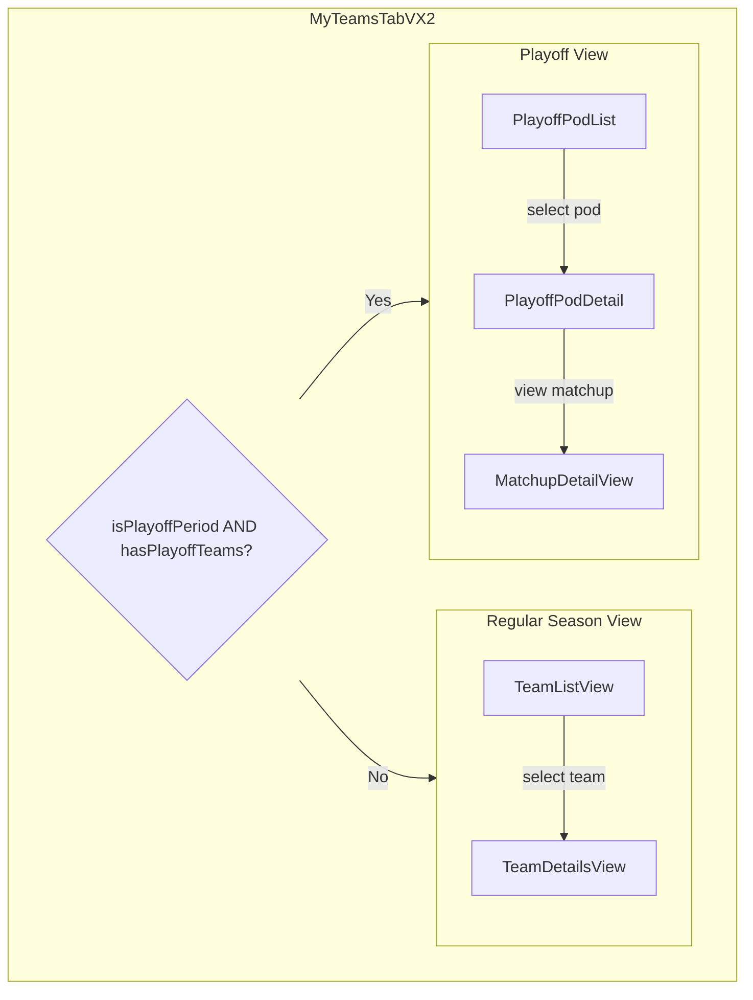
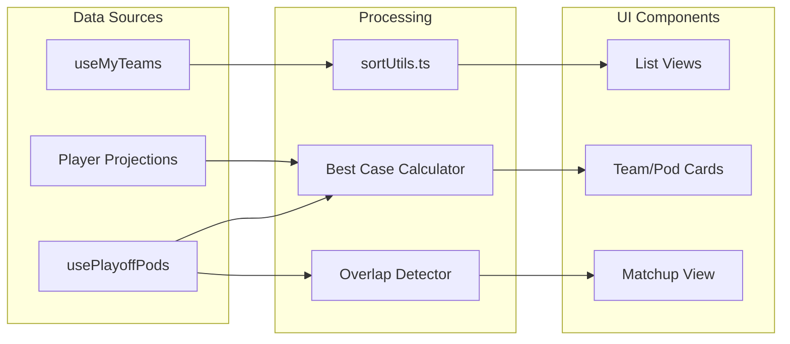

# Teams Tab - Master Implementation Plan

**Last Updated:** 2025-01-06  
**Status:** Ready for Implementation  
**Priority:** High - Defining Feature  
**Philosophy:** Enterprise grade. Fanatical about UX. Use a deterministic, precise approach. Be thorough, take your time, quality over speed.

---

## Executive Summary

This document consolidates all planning and analysis for the Teams Tab sortability and playoff features. It provides a complete roadmap for implementation, including philosophy, constraints, designs, and technical specifications.

### Key Documents Referenced
- `TEAMS_SORTABILITY_ANALYSIS.md` - Comprehensive sortability feature analysis
- `PLAYOFF_DRAWING_DEAD_FEATURE.md` - Playoff features and chances display
- `PLAYOFF_POD_MATCHUP_VIEW.md` - Playoff matchup view design (11 opponents)
- `PLAYOFF_TAB_SANDBOX_PLAN.md` - Development sandbox plan

---

## Architecture Overview

### Component Hierarchy



### Data Flow



---

## Philosophy & Constraints

### Core Philosophy

**Regular Season: Data Only, No Tools, No Analysis**
- Provide raw data only (player names, teams, positions, picks, ADPs, projected points, ranks, bye weeks)
- Basic sorting by raw data fields only
- No derived metrics, no analysis tools, no recommendations
- Users do their own analysis
- **Rationale:** Don't give away whale's alpha

**Playoffs: Exception to Philosophy**
- Playoffs are an exception to "data only" rule
- **Priority #1:** Easy navigation through potentially dozens of teams
- **Priority #2:** Quick understanding of playoff pod situation without scrolling through many teams
- Can show helpful calculations (best case totals, points needed, comparisons)
- Show data that helps users understand chances (no explicit "drawing dead" status)
- **Rationale:** Playoffs require different UX - navigation and quick understanding are critical

### Key Constraints

1. **Single Tournament:** Only one tournament this year - tournament-based sorting simplified
2. **No Analysis:** Regular season = data only, no tools, no analysis
3. **Playoff Exception:** Playoffs allow helpful calculations and data display for quick understanding
4. **No Bye Week Analysis:** Only show individual player bye weeks, no team-level analysis
5. **No General Overlap:** No portfolio-wide overlap analysis (only playoff week matchup overlap)

---

## Feature Overview

### Regular Season Features

#### 1. Team-Level Sorting
**Location:** Team List View

**Sort Options (Raw Data Only):**
- `draftedAt` - Draft date (asc/desc)
- `rank` - Tournament rank (asc/desc)
- `projectedPoints` - Total projected points (asc/desc)
- `name` - Team name (A-Z / Z-A)

**Removed (Tools/Analysis):**
- ❌ Roster value calculations
- ❌ Position counts
- ❌ NFL team distribution metrics
- ❌ Stack counts
- ❌ General portfolio overlap
- ❌ Bye week analysis

**Implementation:**
- Sort dropdown in header
- Visual sort indicators (arrows)
- Persist sort preference (localStorage)
- Secondary sort support (for ties)

#### 2. Player-Level Sorting
**Location:** Team Details View

**Sort Options (Raw Data Only):**
- `pick` - Draft pick number (asc/desc)
- `adp` - Average draft position (asc/desc)
- `projectedPoints` - Projected points (asc/desc)
- `position` - Position (QB, RB, WR, TE)
- `nflTeam` - NFL team (A-Z / Z-A)
- `bye` - Bye week (0-18)
- `name` - Player name (A-Z / Z-A)

**Removed (Tools/Analysis):**
- ❌ ADP value calculations
- ❌ Points per dollar
- ❌ Positional rank
- ❌ NFL team grouping

**Implementation:**
- Clickable column headers
- Per-team sort preferences
- Visual indicators

### Playoff Features

#### 1. Playoff Week Matchup Overlap
**Context:** Activates during playoff weeks (15, 16, 17)

**Feature:**
- Show shared players between user's team and playoff week opponent
- Only for teams in same playoff room/pod
- Only for teams facing each other that specific week
- Raw matchup data (list of shared players)

**Implementation:**
- Detect playoff weeks (15, 16, 17)
- Identify playoff room/pod and matchup opponents
- Display shared players in matchup view
- Show overlap count in team list
- Add `playoffOverlap` sort option

#### 2. Playoff Pod Navigation
**Priority:** Easy navigation through dozens of teams

**Features:**
- Pod grouping in team list
- Pod filter dropdown
- Quick pod switcher
- Search teams across pods
- Status filter (optional, if needed)
- Compact team cards with key info

**Implementation:**
- Group teams by playoff pod
- Filter by pod identifier
- Search functionality
- Compact card design

#### 3. Playoff Pod Quick View
**Priority:** Quick understanding without scrolling

**Features:**
- Pod summary card (compact view)
- All 12 teams visible (user + 11 opponents)
- Current standings
- Best case totals and ranks
- Points needed calculations
- Best case comparisons
- No explicit status badges - data shows chances

**Data Displayed:**
- Current points
- Current rank
- Best case total (current + max possible remaining)
- Best case rank (if scoring max, what's best possible rank?)
- Points needed to reach advancement threshold
- Best case comparison (your best vs. others' best)

**Implementation:**
- Pod detail component
- Expandable/collapsible view
- Sortable columns
- Quick actions

#### 4. Playoff Matchup View (11 Opponents)
**Design:** Similar to competitor's single-opponent view, adapted for 11 opponents

**Main View:**
- List/table of all 11 opponents
- Sortable columns (rank, points, best case, overlap)
- Quick actions per opponent
- Compact but informative

**Detail View:**
- Side-by-side player comparison (like competitor)
- Shared players section (prominent)
- Live game updates
- Status indicators (Out, Doubtful, Not Started)
- Navigation between opponents (swipe left/right)

**Implementation:**
- Opponent list component
- Matchup detail component
- Shared players component
- Navigation controls

---

## Technical Specifications

### Data Models

#### Regular Season Team
```typescript
interface MyTeam {
  id: string;
  name: string;
  tournament: string;
  tournamentId: string;
  rank?: number;
  totalTeams?: number;
  projectedPoints: number;
  draftedAt: string;
  players: TeamPlayer[];
}
```

#### Playoff Team (Extended)
```typescript
interface PlayoffTeam extends MyTeam {
  playoffRoom?: string; // Playoff room/pod identifier
  playoffMatchups?: {
    week15?: { opponentId: string; opponentName: string };
    week16?: { opponentId: string; opponentName: string };
    week17?: { opponentId: string; opponentName: string };
  };
  bestCaseTotal?: number; // Current + max possible remaining
  bestCaseRank?: number; // Best possible rank if scoring max
}
```

#### Playoff Pod
```typescript
interface PlayoffPod {
  id: string;
  name: string;
  week: number; // 15, 16, or 17
  advancementCriteria: 'top2' | 'top4' | 'pointsThreshold';
  teams: PlayoffTeam[]; // 12 teams (user + 11 opponents)
  userTeam: PlayoffTeam;
  opponents: PlayoffTeam[]; // 11 opponents
}
```

### Sort State Management

```typescript
interface SortState {
  // Team list sorting
  teamList: {
    primary: TeamSortOption;
    secondary?: TeamSortOption;
    direction: 'asc' | 'desc';
  };
  
  // Player list sorting (per team)
  playerList: {
    [teamId: string]: {
      primary: PlayerSortOption;
      secondary?: PlayerSortOption;
      direction: 'asc' | 'desc';
    };
  };
  
  // Saved presets
  presets: SortPreset[];
}

type TeamSortOption = 
  | 'draftedAt' | 'rank' | 'projectedPoints' | 'name'
  | 'playoffOverlap'; // Available during playoff weeks only (15, 16, 17)

type PlayerSortOption =
  | 'pick' | 'adp' | 'projectedPoints' | 'position' | 'nflTeam' | 'bye' | 'name';
```

### Persistence
- Store in `localStorage` with key `topdog_teams_sort_preferences`
- Sync across tabs using `storage` event
- Include version for migration if schema changes

---

## View Transition Logic

### When to Show Playoff View vs. Regular Season View

**Important:** Teams that don't make playoffs are removed from the teams tab after Week 14 (end of fantasy regular season).

```typescript
// Pseudo-code for view transition
function getActiveView(currentWeek: number, userTeams: MyTeam[]): 'regular' | 'playoff' {
  // After Week 14, only playoff teams remain in teams tab
  // If user has any teams after Week 14, they are playoff teams
  if (currentWeek > 14 && userTeams.length > 0) {
    return 'playoff';
  }
  
  // Before/during Week 14, check if any teams have playoffRoom
  // (teams may be in playoffs while regular season still ongoing)
  const hasPlayoffTeams = userTeams.some(team => team.playoffRoom !== undefined);
  if (hasPlayoffTeams) {
    return 'playoff';
  }
  
  return 'regular';
}
```

### Transition Conditions

| Week | Has Teams | View Shown |
|------|-----------|------------|
| 1-14 | Yes (no playoffRoom) | Regular Season View |
| 1-14 | Yes (with playoffRoom) | Playoff View |
| 15+ | Yes | Playoff View (only playoff teams remain) |
| 15+ | No | Empty State (all teams eliminated) |

**Note:** 
- After Week 14, non-playoff teams are removed from the teams tab
- Only playoff teams remain, so playoff view is automatically shown
- Playoff sorting and features are only available when user has playoff teams

### Implementation Notes

- After Week 14, if `userTeams.length > 0`, all remaining teams are playoff teams
- Check for `playoffRoom` property to confirm playoff status
- `usePlayoffPods` hook returns empty array if user has no playoff teams
- View transition should be seamless (no full page reload)
- No user toggle - view is determined automatically by data and week

---

## Implementation Phases

### Phase 0: Development Sandbox (Parallel Track)
**Priority:** High (Development Infrastructure)  
**Timeline:** Week 1 (runs parallel to all phases)  
**Files:** `pages/testing-grounds/playoff-teams.tsx`, `lib/mockData/playoffTeams.ts`

**Tasks:**
- [ ] Create sandbox page route
- [ ] Mock data generator for playoff pods
- [ ] Scenario switcher (6 scenarios: default, close race, locked in, mixed, edge cases)
- [ ] Basic UI shell for testing
- [ ] Development tools (debug panel, data manipulator)

**Deliverables:**
- Isolated development environment for playoff features
- Easy testing with various scenarios
- Rapid iteration capability

---

### Phase 1: Regular Season Sorting (MVP)
**Priority:** High  
**Timeline:** Week 1-2  
**Files:** `components/vx2/tabs/my-teams/MyTeamsTabVX2.tsx`, `components/vx2/tabs/my-teams/sortUtils.ts`

**Tasks:**
- [ ] Create `sortUtils.ts` with sort functions
- [ ] Basic team sort dropdown in header
- [ ] Sort by: name, draftedAt, rank, projectedPoints
- [ ] Sort direction toggle (asc/desc)
- [ ] Persist sort preference to localStorage
- [ ] Visual sort indicators (arrows)
- [ ] Secondary sort support (for ties)
- [ ] Automatic sort recalculation when team data updates (with memoization/debouncing)

**Deliverables:**
- Working team list sorting
- Persistent preferences
- Visual feedback

### Phase 2: Player-Level Sorting
**Priority:** Medium  
**Timeline:** Week 3  
**Files:** `components/vx2/tabs/my-teams/MyTeamsTabVX2.tsx` (TeamDetailsView)

**Tasks:**
- [ ] Player sort controls in team details view
- [ ] Sort by: pick, adp, projectedPoints, position, nflTeam, bye, name
- [ ] Clickable column headers
- [ ] Per-team sort preferences
- [ ] Visual indicators

**Deliverables:**
- Working player sorting
- Intuitive UI
- Per-team preferences

### Phase 3: Playoff Pod Navigation & Overlap
**Priority:** High  
**Timeline:** Week 4-5  
**Files:** `components/vx2/tabs/my-teams/playoff/PlayoffPodList.tsx`, `components/vx2/tabs/my-teams/playoff/index.ts`

**Tasks:**
- [ ] View transition logic (regular season vs. playoff)
- [ ] Detect playoff weeks (15, 16, 17)
- [ ] Pod grouping in team list
- [ ] Pod filter dropdown
- [ ] Search teams across pods
- [ ] Compact team cards with key info
- [ ] Identify matchup opponents per week
- [ ] Calculate shared players (overlap)
- [ ] Display overlap count in team list
- [ ] Add `playoffOverlap` sort option

**Deliverables:**
- Easy navigation through many playoff teams
- Pod-based organization
- Overlap detection and display

### Phase 4: Playoff Pod Quick View
**Priority:** High  
**Timeline:** Week 6-7  
**Files:** `components/vx2/tabs/my-teams/playoff/PlayoffPodDetail.tsx`, `components/vx2/tabs/my-teams/playoff/BestCaseDisplay.tsx`

**Tasks:**
- [ ] Pod summary card (compact view)
- [ ] Display all 12 teams in standings
- [ ] Calculate and display best case totals (using projections)
- [ ] Calculate and display best case ranks
- [ ] Calculate points needed to advance (based on highest scorer)
- [ ] Show best case comparisons
- [ ] Sortable columns
- [ ] Expandable/collapsible view
- [ ] Advancement criteria: top X teams by highest total points

**Deliverables:**
- Quick understanding of pod situation
- All key data visible without scrolling

### Phase 5: Playoff Matchup View
**Priority:** High  
**Timeline:** Week 8-9  
**Files:** `components/vx2/tabs/my-teams/playoff/OpponentList.tsx`, `components/vx2/tabs/my-teams/playoff/MatchupDetailView.tsx`, `components/vx2/tabs/my-teams/playoff/SharedPlayersList.tsx`

**Tasks:**
- [ ] Opponent list/table component
- [ ] Sortable columns (rank, points, best case, overlap)
- [ ] Matchup detail view (side-by-side)
- [ ] Shared players section (prominent)
- [ ] Live game updates integration
- [ ] Status indicators (Out, Doubtful, Not Started)
- [ ] Navigation between opponents (swipe left/right gestures)
- [ ] Visual indicators for swipe capability (dots/arrows)

**Deliverables:**
- Full matchup view similar to competitor
- Works with 11 opponents
- Shows overlap prominently

### Phase 6: Integration & Polish
**Priority:** High  
**Timeline:** Week 10  
**Files:** All playoff components

**Tasks:**
- [ ] Integrate all playoff components into main tab
- [ ] End-to-end testing
- [ ] Performance optimization
- [ ] Mobile experience polish
- [ ] Accessibility audit (ARIA labels, keyboard nav)
- [ ] Bug fixes

**Deliverables:**
- Production-ready feature
- Tested and optimized

---

## Development Hours Estimate

### Phase 0: Development Sandbox
**Estimated Hours:** 16-24 hours
- Sandbox page route: 2-3 hours
- Mock data generator: 4-6 hours
- Scenario switcher (6 scenarios): 4-6 hours
- Basic UI shell: 2-3 hours
- Development tools (debug panel, data manipulator): 4-6 hours

### Phase 1: Regular Season Sorting
**Estimated Hours:** 24-32 hours
- Sort utilities (`sortUtils.ts`): 6-8 hours
- Sort dropdown UI: 4-6 hours
- Sort functions (4 sort options): 4-6 hours
- Persistence (localStorage): 2-3 hours
- Visual indicators: 2-3 hours
- Secondary sort: 3-4 hours
- Auto-recalculation with memoization: 3-4 hours

### Phase 2: Player-Level Sorting
**Estimated Hours:** 16-24 hours
- Player sort controls: 4-6 hours
- Sort functions (7 sort options): 6-8 hours
- Clickable column headers: 2-3 hours
- Per-team preferences: 2-3 hours
- Visual indicators: 2-4 hours

### Phase 3: Playoff Pod Navigation & Overlap
**Estimated Hours:** 32-40 hours
- View transition logic: 4-6 hours
- Playoff detection: 2-3 hours
- Pod grouping: 4-6 hours
- Pod filter dropdown: 3-4 hours
- Search functionality: 3-4 hours
- Compact team cards: 4-6 hours
- Matchup opponent identification: 3-4 hours
- Overlap calculation: 4-6 hours
- Overlap display: 3-4 hours
- Sort option integration: 2-3 hours

### Phase 4: Playoff Pod Quick View
**Estimated Hours:** 32-40 hours
- Pod summary card: 4-6 hours
- Standings display (12 teams): 4-6 hours
- Best case calculation: 6-8 hours
- Best case rank calculation: 4-6 hours
- Points needed calculation: 4-6 hours
- Best case comparisons: 4-6 hours
- Sortable columns: 3-4 hours
- Expandable/collapsible: 3-4 hours

### Phase 5: Playoff Matchup View
**Estimated Hours:** 40-48 hours
- Opponent list/table: 6-8 hours
- Sortable columns: 4-6 hours
- Matchup detail view (side-by-side): 12-16 hours
- Shared players section: 4-6 hours
- Live game updates integration: 4-6 hours
- Status indicators: 3-4 hours
- Swipe gesture navigation: 4-6 hours
- Visual swipe indicators: 3-4 hours

### Phase 6: Integration & Polish
**Estimated Hours:** 24-32 hours
- Component integration: 6-8 hours
- End-to-end testing: 6-8 hours
- Performance optimization: 4-6 hours
- Mobile polish: 4-6 hours
- Accessibility audit: 2-3 hours
- Bug fixes: 2-3 hours

### Total Estimate

**Conservative (High):** 184-240 hours
**Realistic (Mid):** 160-200 hours  
**Optimistic (Low):** 136-176 hours

**Assumptions:**
- Single developer working full-time
- Existing codebase familiarity
- No major blockers or API changes needed
- Testing included in each phase
- Code review time not included

**Timeline:** 10 weeks (2 weeks per phase average)
- At 20 hours/week: 200 hours total
- At 16 hours/week: 160 hours total

---

## Cost Estimate

### Hourly Rate Ranges (2025 Market)

**Freelance/Contract Developers:**
- Junior Developer: $40-70/hour
- Mid-Level Developer: $70-120/hour
- Senior Developer: $120-200/hour
- Expert/Specialist: $150-250/hour

**Full-Time Employee (Annual Salary ÷ 2000 hours):**
- Junior Developer: $60k-90k/year = $30-45/hour
- Mid-Level Developer: $90k-140k/year = $45-70/hour
- Senior Developer: $140k-200k/year = $70-100/hour

### Project Cost Estimates

**Using Realistic Estimate (160-200 hours):**

| Developer Level | Hourly Rate | Low (160 hrs) | High (200 hrs) |
|----------------|-------------|---------------|----------------|
| **Junior (Freelance)** | $40-70 | $6,400 - $11,200 | $8,000 - $14,000 |
| **Mid-Level (Freelance)** | $70-120 | $11,200 - $19,200 | $14,000 - $24,000 |
| **Senior (Freelance)** | $120-200 | $19,200 - $32,000 | $24,000 - $40,000 |
| **Expert (Freelance)** | $150-250 | $24,000 - $40,000 | $30,000 - $50,000 |

**Using Conservative Estimate (184-240 hours):**

| Developer Level | Hourly Rate | Low (184 hrs) | High (240 hrs) |
|----------------|-------------|---------------|----------------|
| **Junior (Freelance)** | $40-70 | $7,360 - $12,880 | $9,600 - $16,800 |
| **Mid-Level (Freelance)** | $70-120 | $12,880 - $22,080 | $16,800 - $28,800 |
| **Senior (Freelance)** | $120-200 | $22,080 - $36,800 | $28,800 - $48,000 |
| **Expert (Freelance)** | $150-250 | $27,600 - $46,000 | $36,000 - $60,000 |

### Recommended Approach

**For this project complexity:**
- **Recommended:** Mid-to-Senior level developer ($70-150/hour)
- **Reason:** Requires React/TypeScript expertise, complex state management, performance optimization
- **Estimated Cost:** $11,200 - $30,000 (160-200 hours)

**Cost-Saving Options:**
1. **Phased Approach:** Start with Phase 1-2 (MVP), then add playoff features later
   - Phase 1-2: 40-56 hours = $2,800 - $8,400 (mid-level)
2. **Offshore/Remote:** Lower rates ($30-60/hour) but requires more oversight
   - 160-200 hours = $4,800 - $12,000
3. **Part-time Employee:** If hiring, consider part-time senior dev
   - 4-5 months part-time = $20k-35k salary equivalent

### Additional Costs to Consider

- **Code Review:** 10-20% of dev time = $1,100 - $6,000
- **QA/Testing:** 15-25% of dev time = $1,680 - $7,500
- **Project Management:** 10-15% of dev time = $1,120 - $4,500
- **Bug Fixes/Iterations:** 10-20% buffer = $1,120 - $6,000

**Total Project Cost (with overhead):**
- **Low End:** $15,000 - $20,000 (mid-level, minimal overhead)
- **Realistic:** $20,000 - $35,000 (mid-to-senior, standard overhead)
- **High End:** $35,000 - $60,000 (senior/expert, full QA/PM)

---

## File Structure

```
components/
  vx2/
    tabs/
      my-teams/
        MyTeamsTabVX2.tsx              # Main component (existing)
        sortUtils.ts                   # Sort functions (new)
        playoff/                       # Playoff components (new)
          PlayoffPodList.tsx
          PlayoffPodDetail.tsx
          OpponentList.tsx
          MatchupDetailView.tsx
          SharedPlayersList.tsx
          BestCaseDisplay.tsx
          index.ts                     # Exports
          
  dev/
    playoffSandbox/                    # Development sandbox (new)
      PlayoffTeamsSandbox.tsx
      ScenarioSwitcher.tsx
      DataManipulator.tsx
      DebugPanel.tsx
      PerformanceMonitor.tsx

lib/
  mockData/
    playoffTeams.ts                    # Mock data generator (new)
    playoffScenarios.ts                # Pre-configured scenarios (new)

pages/
  testing-grounds/
    playoff-teams.tsx                   # Sandbox page (new)

docs/
  TEAMS_SORTABILITY_ANALYSIS.md         # Detailed sortability analysis
  PLAYOFF_DRAWING_DEAD_FEATURE.md      # Playoff features analysis
  PLAYOFF_POD_MATCHUP_VIEW.md          # Matchup view design
  PLAYOFF_TAB_SANDBOX_PLAN.md          # Sandbox plan
  TEAMS_TAB_MASTER_PLAN.md             # This document
```

---

## Technical Decisions

1. **Modular Components:** Playoff components in `playoff/` subdirectory, exportable via index.ts
2. **Data Adapter:** Support both mock data (sandbox) and real API data
3. **Performance:** Virtual scrolling for 100+ teams, memoization, lazy loading
4. **Mobile First:** Touch targets (44px min), responsive design, swipe navigation

---

## Data Sources

### Regular Season Data
- **Team Data:** `useMyTeams` hook (existing)
- **Player Data:** `TeamPlayer[]` within each `MyTeam`
- **Projections:** Existing player projection data

### Playoff Data
- **Playoff Pods:** `usePlayoffPods` hook (new, or extend `useMyTeams`)
- **Opponent Rosters:** Fetched via pod API when viewing matchup
- **Best Case Calculation:** Sum of player projections for remaining weeks
- **Overlap Detection:** Compare player arrays between user team and opponent

### Mock Data (Sandbox)
- **Source:** `lib/mockData/playoffTeams.ts`
- **Scenarios:** 6 pre-configured scenarios for testing
- **Switching:** Via `ScenarioSwitcher` component

---

## Error Handling

### Loading States
- **Team List:** Skeleton cards while loading
- **Pod Detail:** Skeleton rows for standings
- **Matchup View:** Placeholder while loading opponent roster

### Error States
- **API Failure:** Show error message with retry button
- **Empty Pods:** Show empty state with explanation
- **Missing Data:** Gracefully handle undefined values (show "-" or "N/A")

### Fallbacks
- **Opponent Roster Unavailable:** Show opponent name only, disable matchup detail
- **Projections Unavailable:** Hide best case columns, show current points only
- **Week Detection Failed:** Default to regular season view

---

## Accessibility

### Keyboard Navigation
- Sort dropdowns: Arrow keys to navigate, Enter to select
- Team list: Tab to navigate, Enter to select team
- Matchup view: Arrow keys to navigate between opponents

### ARIA Labels
- Sort buttons: `aria-label="Sort by [field], currently [direction]"`
- Team cards: `aria-label="[Team name], rank [X], [Y] points"`
- Pod standings: Use `role="table"` with proper headers

### Screen Reader Support
- Announce sort changes
- Announce view transitions (regular → playoff)
- Provide context for data comparisons

### Focus Management
- Return focus to trigger element after modal close
- Focus first item in list after sort change
- Maintain focus when switching opponents in matchup view

---

## Testing Strategy

### Unit Tests
- Sort functions with various inputs
- Edge cases (empty teams, undefined values, ties)
- Sort persistence (localStorage)
- Best case calculations
- Overlap detection

### Integration Tests
- Sort UI interactions
- Sort state persistence across sessions
- Sort with filters/search
- Playoff pod navigation
- Matchup view navigation
- Performance with 100+ teams

### User Testing
- Sort discoverability
- Sort menu usability
- Mobile sort experience
- Playoff navigation ease
- Quick understanding of pod situation
- Matchup view usability

---

## Success Metrics

### Usage Metrics
- % of users who use sorting
- Most popular sort options
- Average sorts per session
- Playoff feature usage

### Performance Metrics
- Sort calculation time (<50ms for 100 teams)
- Render time after sort (<100ms)
- Playoff pod load time
- Matchup view load time
- Memory usage

### User Satisfaction
- User feedback on sortability
- User feedback on playoff features
- Feature requests
- Reported bugs/issues

---

## Integration Points

### With Existing Code
- `MyTeamsTabVX2.tsx` - Main component, add sorting
- `useMyTeams` hook - May need playoff data extension
- `TeamDetailsView` - Add player sorting
- Existing team card components - Add sort indicators

### With Future Features
- Real playoff data API (when available)
- Live game data integration
- Player news integration
- Tournament structure API

---

## Resolved: Best Case Calculation

**Definition:**
```
Best Case Total = Current Points + Sum of (each player's projected points for remaining weeks)
```

**Details:**
- Uses existing player projection data (already available in system)
- Sum projections for all remaining playoff weeks (e.g., if Week 15, sum weeks 15-17)
- This displays existing projection data aggregated, not new analysis
- Calculation is deterministic and based on raw projection data

**Example:**
- Team has 250 points through Week 14
- Week 15 projected: 85 pts, Week 16 projected: 90 pts, Week 17 projected: 82 pts
- Best Case Total = 250 + 85 + 90 + 82 = 507

---

## Resolved: Additional Decisions

### Advancement Criteria
**Decision:** Advancement criteria based on highest scorer
- Top X teams with highest total points advance
- Calculated from current points + remaining week projections
- Advancement threshold determined by pod size and tournament rules

### Real-Time Updates
**Decision:** Sort recalculates automatically when team data updates
- Automatic recalculation on data change
- Performance: Use memoization and debouncing to minimize recalculations
- Visual feedback: Show loading state during recalculation if needed

### Mobile Gestures
**Decision:** Support swipe gestures for opponent navigation
- Swipe left/right in matchup view to navigate between opponents
- Add visual indicators (dots or arrows) to show swipe capability
- Fallback: Button navigation still available for non-gesture users

---

## Next Steps for Implementation

### Week 1
1. **Sandbox Setup:** Create development sandbox (Phase 0)
2. **Phase 1 Start:** Begin regular season sorting

### Weeks 2-3
1. **Complete Phase 1:** Regular season team sorting
2. **Complete Phase 2:** Player-level sorting

### Weeks 4-5
1. **Complete Phase 3:** Playoff pod navigation & overlap

### Weeks 6-7
1. **Complete Phase 4:** Playoff pod quick view

### Weeks 8-9
1. **Complete Phase 5:** Playoff matchup view

### Week 10
1. **Complete Phase 6:** Integration, testing, polish
2. **Production:** Deploy to production

---

## Reference Documents

### Detailed Analysis
- **`TEAMS_SORTABILITY_ANALYSIS.md`**
  - Complete sortability feature analysis
  - All sort options documented
  - Philosophy and constraints
  - Technical specifications

- **`PLAYOFF_DRAWING_DEAD_FEATURE.md`**
  - Playoff features analysis
  - Chances display approach
  - Best case calculations
  - UI mockups

- **`PLAYOFF_POD_MATCHUP_VIEW.md`**
  - Matchup view design (11 opponents)
  - Competitor analysis
  - Component specifications
  - UI layouts

- **`PLAYOFF_TAB_SANDBOX_PLAN.md`**
  - Development sandbox plan
  - Mock data scenarios
  - Development workflow
  - Testing strategy

### Code References
- `components/vx2/tabs/my-teams/MyTeamsTabVX2.tsx` - Main component
- `components/vx2/hooks/data/useMyTeams.ts` - Data hook
- `components/vx2/draft-room/components/PlayerList.tsx` - Reference for sorting UI
- `components/vx2/hooks/data/useExposure.ts` - Reference for sort state management

---

## Handoff Notes

**For the Next Developer:**

1. **Start with Phase 0 (Sandbox)** - Build mock data and sandbox first, then develop features in isolation
2. **Philosophy is non-negotiable** - Regular season = data only. Playoffs = exception for navigation/understanding
3. **Test with 100+ teams** - Users may have dozens of playoff teams, performance is critical
4. **Mobile is primary** - Most users are on mobile, prioritize touch targets and swipe gestures
5. **No "drawing dead" labels** - Show the data (best case totals, ranks), let users interpret
6. **Reference documents have details** - This is the overview; see referenced docs for specifics

**Quick Start:**
1. Review "Philosophy & Constraints" section
2. Set up sandbox (Phase 0)
3. Begin Phase 1 (sorting)
4. Follow phases in order

---

**Document Status:** Complete and Ready for Implementation  
**Last Updated:** 2025-01-06  
**Next Review:** After Phase 1 completion

