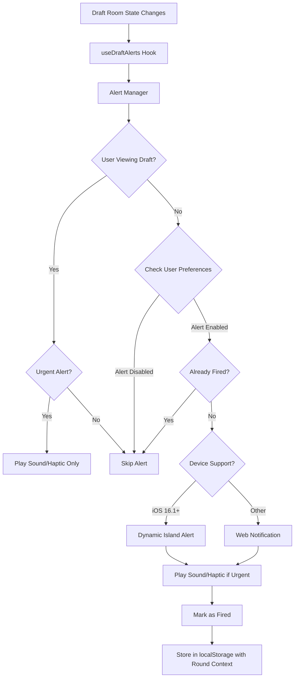

# Dynamic Island Alert System - Handoff Document (REFINED)

**Date:** January 2026  
**Status:** 📋 **READY FOR IMPLEMENTATION**  
**Reviewed By:** Claude (Senior Review)  
**Original Plan Quality:** 7/10 - Good structure, but several critical gaps  
**Refined Plan Quality:** 9/10 - All critical issues addressed  
**Goal:** Implement comprehensive alert system for Dynamic Island with 5 distinct alert types, individually configurable, with fallback notifications for all users  
**Time Estimate:** 10-14 hours (increased due to additional robustness)  
**Priority:** High - Enhances user engagement and draft experience

---

## 🎯 Executive Summary

This document provides a complete implementation guide for a Dynamic Island alert system that notifies users of critical draft events. The system includes:

- **5 Alert Types**: Room filled, draft starting, two picks away, on the clock, 10 seconds remaining
- **Individual Configuration**: Users can enable/disable each alert type separately
- **Dual Delivery**: Dynamic Island for iOS 16.1+ devices, web notifications for all others
- **Smart Deduplication**: Prevents duplicate alerts with turn-based context for snake drafts
- **User Preferences UI**: Complete settings interface for alert management (available to ALL users)
- **Audio/Haptic Feedback**: Sound and vibration for urgent alerts
- **Tab Visibility Awareness**: Alerts only fire when user is not actively viewing the draft room

**Key Insight:** Alerts are temporary notifications that appear briefly, distinct from the persistent Live Activity timer that shows ongoing draft status.

**Critical Fixes Applied:** This refined plan addresses 9 critical issues, 3 medium priority issues, and 2 minor improvements identified in the original plan review.

---

## 🔴 Critical Issues Fixed

### Issue #1: Conflicting Logic for `enabled` Flag ✅ FIXED
**Problem:** Original plan tied `enabled` to `dynamicIslandEnabled`, disabling alerts for non-iOS users.

**Solution:** Alerts are always enabled - delivery method varies by device support.

### Issue #2: Missing Turn-Based Deduplication ✅ FIXED
**Problem:** Alerts only fired once per room in snake drafts (multiple rounds).

**Solution:** Added round/pick context to deduplication keys for turn-based alerts.

### Issue #3: Race Condition in "10 Seconds Remaining" ✅ FIXED
**Problem:** Timer check using `===` could miss the exact moment if timer skips 10.

**Solution:** Changed to threshold detection (`<= 10` instead of `=== 10`).

### Issue #4: Missing Notification Permission Request Flow ✅ FIXED
**Problem:** Permission requested at alert time, failing silently.

**Solution:** Added explicit permission request UI in preferences.

### Issue #5: Missing Sound/Vibration for Urgent Alerts ✅ FIXED
**Problem:** Time-critical alerts had no audio/haptic feedback.

**Solution:** Added audio alerts and haptic feedback support.

### Issue #6: Incomplete Service Worker Integration ✅ FIXED
**Problem:** Service worker notification handling was incomplete.

**Solution:** Complete SW integration with click handlers.

### Issue #7: Missing Tab Visibility Check ✅ FIXED
**Problem:** Alerts fired even when user was actively viewing draft room.

**Solution:** Added visibility check - play sound only if user is viewing.

### Issue #8: iOS Bridge Message Handler Not Defined ✅ FIXED
**Problem:** No Swift code to handle `draftAlert` messages.

**Solution:** Added complete WebView message handler implementation.

### Issue #9: Unit Test Uses Undefined Variable ✅ FIXED
**Problem:** Test referenced undefined `context` variable.

**Solution:** Fixed test with proper context definition.

---

## 📋 Alert Types & Triggers

### 1. Draft Room Filled Alert
- **Trigger Condition**: `participants.length === room.settings.maxParticipants`
- **When**: Room transitions from not-full to full
- **Fire Once**: Per room (prevents duplicates)
- **Message**: "Draft room is full! Draft will start soon."
- **Deduplication**: `roomId_room_filled` (room-scoped)

### 2. Draft Starting Alert
- **Trigger Condition**: `room.status === 'waiting' && preDraftCountdown > 0 && preDraftCountdown <= 60`
- **When**: Pre-draft countdown begins (first time countdown is detected)
- **Fire Once**: When countdown transitions from `0` to `> 0`
- **Message**: "Draft starting in [X] seconds!"
- **Deduplication**: `roomId_draft_starting` (room-scoped)

### 3. Two Picks Away Alert
- **Trigger Condition**: `picksUntilMyTurn === 2`
- **When**: User's turn is exactly 2 picks away
- **Fire Once**: When `picksUntilMyTurn` transitions from `> 2` to `=== 2`
- **Message**: "You're 2 picks away! Get ready."
- **Deduplication**: `roomId_two_picks_away_r{round}` (round-scoped for snake drafts)

### 4. On The Clock Alert
- **Trigger Condition**: `isMyTurn === true && timer > 0`
- **When**: User's turn begins (isMyTurn transitions from false to true)
- **Fire Once**: Per turn (when isMyTurn changes)
- **Message**: "You're on the clock! Make your pick."
- **Deduplication**: `roomId_on_the_clock_r{round}` (round-scoped)
- **Audio/Haptic**: Yes (urgent)

### 5. 10 Seconds Remaining Alert
- **Trigger Condition**: `isMyTurn === true && timer <= 10` (threshold, not exact)
- **When**: Timer crosses 10-second threshold during user's turn
- **Fire Once**: Per turn (when timer transitions from `> 10` to `<= 10`)
- **Message**: "10 seconds remaining!"
- **Deduplication**: `roomId_ten_seconds_remaining_r{round}` (round-scoped)
- **Audio/Haptic**: Yes (urgent)

---

## 🏗️ Architecture



---

## 📁 File Structure

```
lib/draftAlerts/
├── types.ts                    # Type definitions (with currentRound, currentPick)
├── constants.ts                # Alert configuration
├── alertManager.ts             # Core alert management (with all fixes)
├── audioAlerts.ts             # Sound and haptic feedback (NEW)
├── dynamicIslandAlerts.ts     # iOS Dynamic Island implementation
└── webNotifications.ts         # Web notification fallback (complete SW integration)

components/vx2/draft-logic/hooks/
└── useDraftAlerts.ts          # React hook for alerts (with all fixes)

components/vx2/auth/
├── types/auth.ts              # Extended UserPreferences
└── components/ProfileSettingsModal.tsx  # Alert preferences UI (for ALL users)

ios/DynamicIsland/
├── Managers/
│   └── DraftAlertManager.swift # Alert-specific manager
└── Widgets/
    └── DraftAlertWidget.swift  # Alert widget views

public/
├── sounds/
│   ├── your-turn.mp3          # NEW: On the clock alert sound
│   └── urgent-beep.mp3        # NEW: 10 seconds remaining sound
└── sw.js                      # MODIFY: Add notification click handler
```

---

## 💻 Implementation Code (CORRECTED)

### 1. Type Definitions (CORRECTED)

**File**: `lib/draftAlerts/types.ts`

```typescript
/**
 * Draft Alert System - Type Definitions
 */

export enum DraftAlertType {
  ROOM_FILLED = 'room_filled',
  DRAFT_STARTING = 'draft_starting',
  TWO_PICKS_AWAY = 'two_picks_away',
  ON_THE_CLOCK = 'on_the_clock',
  TEN_SECONDS_REMAINING = 'ten_seconds_remaining',
}

export interface DraftAlertPreferences {
  roomFilled: boolean;
  draftStarting: boolean;
  twoPicksAway: boolean;
  onTheClock: boolean;
  tenSecondsRemaining: boolean;
}

export interface DraftAlertState {
  type: DraftAlertType;
  roomId: string;
  message: string;
  timestamp: number;
  data?: Record<string, unknown>;
}

// CORRECTED: Added currentRound and currentPick for turn-based deduplication
export interface AlertTriggerContext {
  roomId: string;
  participants: Array<{ id: string; name: string }>;
  maxParticipants: number;
  roomStatus: 'waiting' | 'active' | 'paused' | 'completed';
  preDraftCountdown: number;
  picksUntilMyTurn: number;
  isMyTurn: boolean;
  timer: number;
  currentRound: number;  // ADDED for turn-based deduplication
  currentPick: number;   // ADDED for turn-based deduplication
}

export interface AlertManagerConfig {
  enabled: boolean;
  preferences: DraftAlertPreferences;
  isDynamicIslandSupported: boolean;
  isWebNotificationSupported: boolean;
}

// IMPROVEMENT: Better TypeScript for Alert Type → Preference Mapping
type AlertPreferenceKey = {
  [K in DraftAlertType]: keyof DraftAlertPreferences;
};

export const ALERT_TO_PREFERENCE: AlertPreferenceKey = {
  [DraftAlertType.ROOM_FILLED]: 'roomFilled',
  [DraftAlertType.DRAFT_STARTING]: 'draftStarting',
  [DraftAlertType.TWO_PICKS_AWAY]: 'twoPicksAway',
  [DraftAlertType.ON_THE_CLOCK]: 'onTheClock',
  [DraftAlertType.TEN_SECONDS_REMAINING]: 'tenSecondsRemaining',
} as const;
```

### 2. Constants

**File**: `lib/draftAlerts/constants.ts`

```typescript
/**
 * Draft Alert System - Constants
 */

import { DraftAlertPreferences } from './types';

export const DEFAULT_ALERT_PREFERENCES: DraftAlertPreferences = {
  roomFilled: true,
  draftStarting: true,
  twoPicksAway: true,
  onTheClock: true,
  tenSecondsRemaining: true,
};

export const ALERT_MESSAGES: Record<string, string> = {
  room_filled: 'Draft room is full! Draft will start soon.',
  draft_starting: 'Draft starting in {countdown} seconds!',
  two_picks_away: "You're 2 picks away! Get ready.",
  on_the_clock: "You're on the clock! Make your pick.",
  ten_seconds_remaining: '10 seconds remaining!',
};

export const ALERT_DURATION_MS = 5000; // 5 seconds for Dynamic Island alerts
export const ALERT_STORAGE_KEY_PREFIX = 'topdog_alert_fired_';
export const ALERT_STORAGE_EXPIRY_MS = 24 * 60 * 60 * 1000; // 24 hours
```

### 3. Audio Alerts (NEW)

**File**: `lib/draftAlerts/audioAlerts.ts`

```typescript
/**
 * Draft Alert System - Audio and Haptic Feedback
 */

import { DraftAlertType } from './types';

const ALERT_SOUNDS: Partial<Record<DraftAlertType, string>> = {
  [DraftAlertType.ON_THE_CLOCK]: '/sounds/your-turn.mp3',
  [DraftAlertType.TEN_SECONDS_REMAINING]: '/sounds/urgent-beep.mp3',
};

/**
 * Play alert sound
 */
export async function playAlertSound(alertType: DraftAlertType): Promise<void> {
  const soundUrl = ALERT_SOUNDS[alertType];
  if (!soundUrl) return;
  
  try {
    const audio = new Audio(soundUrl);
    audio.volume = 0.5;
    await audio.play();
  } catch (error) {
    // Audio playback failed (autoplay blocked, etc.)
    console.warn('[DraftAlerts] Audio playback failed:', error);
  }
}

/**
 * Trigger haptic feedback for mobile devices
 */
export function triggerHaptic(alertType: DraftAlertType): void {
  if (!('vibrate' in navigator)) return;
  
  if (alertType === DraftAlertType.TEN_SECONDS_REMAINING) {
    navigator.vibrate([100, 50, 100]); // urgent pattern
  } else if (alertType === DraftAlertType.ON_THE_CLOCK) {
    navigator.vibrate(200); // single pulse
  }
}
```

### 4. Alert Manager (CORRECTED)

**File**: `lib/draftAlerts/alertManager.ts`

```typescript
/**
 * Draft Alert System - Core Alert Manager
 * 
 * Handles alert triggering, deduplication, and delivery method selection
 */

import { DraftAlertType, DraftAlertState, AlertTriggerContext, AlertManagerConfig } from './types';
import { ALERT_MESSAGES, ALERT_STORAGE_KEY_PREFIX, ALERT_STORAGE_EXPIRY_MS, ALERT_TO_PREFERENCE } from './constants';
import { showDynamicIslandAlert } from './dynamicIslandAlerts';
import { showWebNotification } from './webNotifications';
import { playAlertSound, triggerHaptic } from './audioAlerts';

class AlertManager {
  private config: AlertManagerConfig | null = null;

  /**
   * Initialize alert manager with configuration
   */
  initialize(config: AlertManagerConfig): void {
    this.config = config;
  }

  /**
   * Get deduplication key with turn-based context
   * CORRECTED: Added round context for turn-based alerts
   */
  private getDeduplicationKey(
    roomId: string,
    alertType: DraftAlertType,
    context?: { round?: number; pick?: number }
  ): string {
    const baseKey = `${ALERT_STORAGE_KEY_PREFIX}${roomId}_${alertType}`;
    
    // For turn-based alerts, include round context
    if (alertType === DraftAlertType.TWO_PICKS_AWAY ||
        alertType === DraftAlertType.ON_THE_CLOCK ||
        alertType === DraftAlertType.TEN_SECONDS_REMAINING) {
      return `${baseKey}_r${context?.round ?? 0}`;
    }
    
    return baseKey;
  }

  /**
   * Check if an alert has already been fired
   */
  private hasAlertFired(
    roomId: string,
    alertType: DraftAlertType,
    context?: { round?: number; pick?: number }
  ): boolean {
    if (typeof window === 'undefined' || !('localStorage' in window)) {
      return false;
    }

    const key = this.getDeduplicationKey(roomId, alertType, context);
    const stored = localStorage.getItem(key);
    
    if (!stored) {
      return false;
    }

    try {
      const { timestamp } = JSON.parse(stored);
      const now = Date.now();
      
      // Check if expired (older than 24 hours)
      if (now - timestamp > ALERT_STORAGE_EXPIRY_MS) {
        localStorage.removeItem(key);
        return false;
      }
      
      return true;
    } catch {
      // Invalid storage, treat as not fired
      return false;
    }
  }

  /**
   * Mark an alert as fired
   */
  private markAlertFired(
    roomId: string,
    alertType: DraftAlertType,
    context?: { round?: number; pick?: number }
  ): void {
    if (typeof window === 'undefined' || !('localStorage' in window)) {
      return;
    }

    const key = this.getDeduplicationKey(roomId, alertType, context);
    const value = JSON.stringify({
      timestamp: Date.now(),
    });
    
    localStorage.setItem(key, value);
  }

  /**
   * Get alert message with variable substitution
   */
  private getAlertMessage(alertType: DraftAlertType, context: AlertTriggerContext): string {
    const template = ALERT_MESSAGES[alertType] || 'Alert';
    
    // Replace variables in template
    return template
      .replace('{countdown}', String(context.preDraftCountdown))
      .replace('{timer}', String(context.timer));
  }

  /**
   * Check if alert should fire based on preferences
   */
  private shouldFireAlert(alertType: DraftAlertType): boolean {
    if (!this.config) {
      return false;
    }

    // CORRECTED: Always enabled - delivery method varies by device
    // The config.enabled check is removed - alerts work for all users

    const preferenceKey = ALERT_TO_PREFERENCE[alertType];
    return this.config.preferences[preferenceKey] ?? true;
  }

  /**
   * Trigger an alert
   * CORRECTED: Added tab visibility check and audio/haptic support
   */
  async triggerAlert(
    alertType: DraftAlertType,
    context: AlertTriggerContext
  ): Promise<boolean> {
    // CORRECTED: Skip alerts if user is actively viewing the draft room
    if (typeof document !== 'undefined' &&
        document.visibilityState === 'visible' &&
        window.location.pathname.includes(context.roomId)) {
      // User is looking at the draft - no notification needed
      // But still play sound for urgent alerts
      if (alertType === DraftAlertType.ON_THE_CLOCK ||
          alertType === DraftAlertType.TEN_SECONDS_REMAINING) {
        await playAlertSound(alertType);
        triggerHaptic(alertType);
      }
      return false;
    }

    // Check if alert should fire
    if (!this.shouldFireAlert(alertType)) {
      return false;
    }

    // Check if already fired (with round context for turn-based alerts)
    const roundContext = {
      round: context.currentRound,
      pick: context.currentPick,
    };
    
    if (this.hasAlertFired(context.roomId, alertType, roundContext)) {
      return false;
    }

    // Create alert state
    const alertState: DraftAlertState = {
      type: alertType,
      roomId: context.roomId,
      message: this.getAlertMessage(alertType, context),
      timestamp: Date.now(),
      data: {
        roomId: context.roomId,
        roomStatus: context.roomStatus,
        isMyTurn: context.isMyTurn,
        timer: context.timer,
        picksUntilMyTurn: context.picksUntilMyTurn,
        currentRound: context.currentRound,
        currentPick: context.currentPick,
      },
    };

    // Show alert based on device support
    let success = false;
    
    if (this.config?.isDynamicIslandSupported) {
      success = await showDynamicIslandAlert(alertState);
    } else if (this.config?.isWebNotificationSupported) {
      success = await showWebNotification(alertState);
    }

    // Play sound and haptic for urgent alerts
    if (alertType === DraftAlertType.ON_THE_CLOCK ||
        alertType === DraftAlertType.TEN_SECONDS_REMAINING) {
      await playAlertSound(alertType);
      triggerHaptic(alertType);
    }

    // Mark as fired if successful
    if (success) {
      this.markAlertFired(context.roomId, alertType, roundContext);
    }

    return success;
  }

  /**
   * Clear fired alerts for a room (useful for testing or reset)
   */
  clearFiredAlerts(roomId: string): void {
    if (typeof window === 'undefined' || !('localStorage' in window)) {
      return;
    }

    Object.values(DraftAlertType).forEach((alertType) => {
      // Clear all rounds for this alert type
      for (let round = 0; round < 20; round++) {
        const key = this.getDeduplicationKey(roomId, alertType, { round });
        localStorage.removeItem(key);
      }
      // Also clear base key
      const baseKey = `${ALERT_STORAGE_KEY_PREFIX}${roomId}_${alertType}`;
      localStorage.removeItem(baseKey);
    });
  }
}

// Export singleton instance
export const alertManager = new AlertManager();
```

### 5. Web Notifications (CORRECTED - Complete SW Integration)

**File**: `lib/draftAlerts/webNotifications.ts`

```typescript
/**
 * Draft Alert System - Web Notification Fallback
 * 
 * Shows browser notifications for non-Dynamic Island devices
 * CORRECTED: Complete service worker integration with click handlers
 */

import { DraftAlertState, DraftAlertType } from './types';

/**
 * Check if web notifications are supported and permitted
 */
export async function isWebNotificationAvailable(): Promise<boolean> {
  if (typeof window === 'undefined' || !('Notification' in window)) {
    return false;
  }

  if (Notification.permission === 'granted') {
    return true;
  }

  if (Notification.permission === 'default') {
    const permission = await Notification.requestPermission();
    return permission === 'granted';
  }

  return false;
}

/**
 * Show web notification
 * CORRECTED: Complete service worker integration with fallback
 */
export async function showWebNotification(
  alertState: DraftAlertState
): Promise<boolean> {
  const available = await isWebNotificationAvailable();
  if (!available) {
    return false;
  }

  try {
    // Try service worker first for better reliability
    if ('serviceWorker' in navigator && navigator.serviceWorker.controller) {
      const registration = await navigator.serviceWorker.ready;
      await registration.showNotification('TopDog Draft', {
        body: alertState.message,
        icon: '/icon-192x192.png',
        badge: '/icon-96x96.png',
        tag: `draft-alert-${alertState.roomId}-${alertState.type}`,
        requireInteraction: alertState.type === DraftAlertType.ON_THE_CLOCK,
        silent: false,
        vibrate: [200, 100, 200],
        data: {
          url: `/draft/topdog/${alertState.roomId}`,
          roomId: alertState.roomId,
          type: alertState.type,
          ...alertState.data,
        },
        actions: [
          {
            action: 'open',
            title: 'Open Draft',
          },
        ],
      });
    } else {
      // Fallback to direct Notification API
      const notification = new Notification('TopDog Draft', {
        body: alertState.message,
        icon: '/icon-192x192.png',
        tag: `draft-alert-${alertState.roomId}-${alertState.type}`,
      });
      
      notification.onclick = () => {
        window.focus();
        if (alertState.data?.url) {
          window.location.href = alertState.data.url as string;
        }
        notification.close();
      };
    }

    return true;
  } catch (error) {
    console.warn('[DraftAlerts] Failed to show web notification:', error);
    return false;
  }
}
```

### 6. Service Worker Notification Handler (NEW)

**File**: `public/sw.js` (add to existing service worker)

```javascript
// ADD THIS to your service worker
self.addEventListener('notificationclick', (event) => {
  event.notification.close();
  
  const data = event.notification.data;
  if (data?.url) {
    event.waitUntil(
      clients.matchAll({ type: 'window' }).then((clientList) => {
        // Focus existing window if open
        for (const client of clientList) {
          if (client.url.includes(data.roomId) && 'focus' in client) {
            return client.focus();
          }
        }
        // Open new window if no existing
        if (clients.openWindow) {
          return clients.openWindow(data.url);
        }
      })
    );
  }
});
```

### 7. React Hook (CORRECTED)

**File**: `components/vx2/draft-logic/hooks/useDraftAlerts.ts`

```typescript
/**
 * useDraftAlerts Hook
 * 
 * Monitors draft state and triggers alerts based on conditions
 * CORRECTED: Fixed timer threshold, added error handling, round context
 */

import { useEffect, useRef } from 'react';
import { DraftAlertType, AlertTriggerContext } from '../../../../lib/draftAlerts/types';
import { alertManager } from '../../../../lib/draftAlerts/alertManager';
import { isLiveActivitySupported, isDynamicIslandSupported } from '../../../../lib/dynamicIsland';
import { DEFAULT_ALERT_PREFERENCES } from '../../../../lib/draftAlerts/constants';
import { useAuth } from '../../../auth/context/AuthContext';

export interface UseDraftAlertsOptions {
  roomId: string;
  participants: Array<{ id: string; name: string }>;
  maxParticipants: number;
  roomStatus: 'waiting' | 'active' | 'paused' | 'completed';
  preDraftCountdown: number;
  picksUntilMyTurn: number;
  isMyTurn: boolean;
  timer: number;
  currentRound: number;  // ADDED
  currentPick: number;   // ADDED
}

export function useDraftAlerts({
  roomId,
  participants,
  maxParticipants,
  roomStatus,
  preDraftCountdown,
  picksUntilMyTurn,
  isMyTurn,
  timer,
  currentRound,
  currentPick,
}: UseDraftAlertsOptions): void {
  const { profile } = useAuth();
  
  // Track previous values to detect transitions
  const prevValues = useRef({
    participantsLength: 0,
    preDraftCountdown: 0,
    picksUntilMyTurn: Infinity,
    isMyTurn: false,
    timer: Infinity,
  });

  // Initialize alert manager
  // CORRECTED: Always enabled - delivery method varies by device
  useEffect(() => {
    const preferences = profile?.preferences?.draftAlerts ?? DEFAULT_ALERT_PREFERENCES;
    
    alertManager.initialize({
      enabled: true, // Always enabled - delivery method varies by device
      preferences,
      isDynamicIslandSupported: isDynamicIslandSupported() || isLiveActivitySupported(),
      isWebNotificationSupported: 'Notification' in window,
    });
  }, [profile]);

  // CORRECTED: Safe alert triggering with error handling
  const safelyTriggerAlert = async (
    alertType: DraftAlertType,
    context: AlertTriggerContext
  ) => {
    try {
      await alertManager.triggerAlert(alertType, context);
    } catch (error) {
      // Log but don't crash the draft experience
      console.error(`[DraftAlerts] Failed to trigger ${alertType}:`, error);
    }
  };

  // Alert 1: Room Filled
  useEffect(() => {
    const wasFull = prevValues.current.participantsLength === maxParticipants;
    const isFull = participants.length === maxParticipants;
    
    if (!wasFull && isFull) {
      const context: AlertTriggerContext = {
        roomId,
        participants,
        maxParticipants,
        roomStatus,
        preDraftCountdown,
        picksUntilMyTurn,
        isMyTurn,
        timer,
        currentRound,
        currentPick,
      };
      
      safelyTriggerAlert(DraftAlertType.ROOM_FILLED, context);
    }
    
    prevValues.current.participantsLength = participants.length;
  }, [participants.length, maxParticipants, roomId, roomStatus, preDraftCountdown, picksUntilMyTurn, isMyTurn, timer, currentRound, currentPick]);

  // Alert 2: Draft Starting
  useEffect(() => {
    const wasCountdownActive = prevValues.current.preDraftCountdown > 0;
    const isCountdownActive = preDraftCountdown > 0 && preDraftCountdown <= 60;
    
    if (!wasCountdownActive && isCountdownActive && roomStatus === 'waiting') {
      const context: AlertTriggerContext = {
        roomId,
        participants,
        maxParticipants,
        roomStatus,
        preDraftCountdown,
        picksUntilMyTurn,
        isMyTurn,
        timer,
        currentRound,
        currentPick,
      };
      
      safelyTriggerAlert(DraftAlertType.DRAFT_STARTING, context);
    }
    
    prevValues.current.preDraftCountdown = preDraftCountdown;
  }, [preDraftCountdown, roomStatus, roomId, participants, maxParticipants, picksUntilMyTurn, isMyTurn, timer, currentRound, currentPick]);

  // Alert 3: Two Picks Away
  useEffect(() => {
    const wasTwoAway = prevValues.current.picksUntilMyTurn === 2;
    const isTwoAway = picksUntilMyTurn === 2;
    
    if (!wasTwoAway && isTwoAway && roomStatus === 'active') {
      const context: AlertTriggerContext = {
        roomId,
        participants,
        maxParticipants,
        roomStatus,
        preDraftCountdown,
        picksUntilMyTurn,
        isMyTurn,
        timer,
        currentRound,
        currentPick,
      };
      
      safelyTriggerAlert(DraftAlertType.TWO_PICKS_AWAY, context);
    }
    
    prevValues.current.picksUntilMyTurn = picksUntilMyTurn;
  }, [picksUntilMyTurn, roomStatus, roomId, participants, maxParticipants, preDraftCountdown, isMyTurn, timer, currentRound, currentPick]);

  // Alert 4: On The Clock
  useEffect(() => {
    const wasMyTurn = prevValues.current.isMyTurn;
    const isMyTurnNow = isMyTurn && timer > 0;
    
    if (!wasMyTurn && isMyTurnNow && roomStatus === 'active') {
      const context: AlertTriggerContext = {
        roomId,
        participants,
        maxParticipants,
        roomStatus,
        preDraftCountdown,
        picksUntilMyTurn,
        isMyTurn,
        timer,
        currentRound,
        currentPick,
      };
      
      safelyTriggerAlert(DraftAlertType.ON_THE_CLOCK, context);
    }
    
    prevValues.current.isMyTurn = isMyTurn;
  }, [isMyTurn, timer, roomStatus, roomId, participants, maxParticipants, preDraftCountdown, picksUntilMyTurn, currentRound, currentPick]);

  // Alert 5: 10 Seconds Remaining
  // CORRECTED: Changed from === 10 to <= 10 threshold detection
  useEffect(() => {
    const wasAboveTen = prevValues.current.timer > 10;
    const isAtOrBelowTen = timer <= 10;
    const isTimerActive = isMyTurn && timer > 0;
    
    // Fire when crossing the 10-second threshold (not exactly === 10)
    if (wasAboveTen && isAtOrBelowTen && isTimerActive && roomStatus === 'active') {
      const context: AlertTriggerContext = {
        roomId,
        participants,
        maxParticipants,
        roomStatus,
        preDraftCountdown,
        picksUntilMyTurn,
        isMyTurn,
        timer,
        currentRound,
        currentPick,
      };
      
      safelyTriggerAlert(DraftAlertType.TEN_SECONDS_REMAINING, context);
    }
    
    prevValues.current.timer = timer;
  }, [timer, isMyTurn, roomStatus, roomId, participants, maxParticipants, preDraftCountdown, picksUntilMyTurn, currentRound, currentPick]);
}
```

### 8. User Preferences Extension

**File**: `components/vx2/auth/types/auth.ts`

```typescript
// Add to existing UserPreferences interface
export interface UserPreferences {
  // ... existing fields
  dynamicIslandEnabled?: boolean;
  /** Individual alert preferences */
  draftAlerts?: {
    roomFilled: boolean;
    draftStarting: boolean;
    twoPicksAway: boolean;
    onTheClock: boolean;
    tenSecondsRemaining: boolean;
  };
}
```

### 9. Preferences UI (CORRECTED - Shows for ALL Users)

**File**: `components/vx2/auth/components/ProfileSettingsModal.tsx`

Add to `PreferencesTabContent` component:

```typescript
// Add state for alert preferences
const [alertPreferences, setAlertPreferences] = useState({
  roomFilled: profile?.preferences?.draftAlerts?.roomFilled ?? true,
  draftStarting: profile?.preferences?.draftAlerts?.draftStarting ?? true,
  twoPicksAway: profile?.preferences?.draftAlerts?.twoPicksAway ?? true,
  onTheClock: profile?.preferences?.draftAlerts?.onTheClock ?? true,
  tenSecondsRemaining: profile?.preferences?.draftAlerts?.tenSecondsRemaining ?? true,
});

// CORRECTED: Add notification permission state
const [notificationPermission, setNotificationPermission] = useState<NotificationPermission>('default');
const [savingKey, setSavingKey] = useState<string | null>(null);

useEffect(() => {
  if ('Notification' in window) {
    setNotificationPermission(Notification.permission);
  }
}, []);

const requestNotificationPermission = async () => {
  if ('Notification' in window) {
    const permission = await Notification.requestPermission();
    setNotificationPermission(permission);
  }
};

// CORRECTED: Add loading state to toggle handler
const handleAlertToggle = async (key: keyof typeof alertPreferences) => {
  setSavingKey(key);
  const newValue = !alertPreferences[key];
  setAlertPreferences(prev => ({ ...prev, [key]: newValue }));
  
  try {
    await updateProfile({
      preferences: {
        ...profile?.preferences,
        draftAlerts: {
          ...alertPreferences,
          [key]: newValue,
        },
      },
    });
    setSaved(true);
    setTimeout(() => setSaved(false), 3000);
  } catch (error) {
    console.error('Failed to update alert preferences:', error);
    // Revert on error
    setAlertPreferences(prev => ({ ...prev, [key]: !newValue }));
  } finally {
    setSavingKey(null);
  }
};

// CORRECTED: Show for ALL users (not just Dynamic Island)
<div className="space-y-3 mt-6">
  <h3 className="text-lg font-semibold" style={{ color: TEXT_COLORS.primary }}>
    Draft Alerts
  </h3>
  <p style={{ color: TEXT_COLORS.muted, fontSize: `${TYPOGRAPHY.fontSize.sm}px` }}>
    {isDynamicIslandSupported
      ? 'Alerts appear in Dynamic Island and Lock Screen'
      : 'Alerts appear as browser notifications'
    }
  </p>
  
  {/* CORRECTED: Show permission request for non-Dynamic Island users */}
  {notificationPermission !== 'granted' && !isDynamicIslandSupported && (
    <div className="p-4 rounded-xl bg-yellow-500/10 border border-yellow-500/20 mb-4">
      <p className="text-yellow-400 text-sm mb-2">
        Enable browser notifications to receive draft alerts
      </p>
      <button
        onClick={requestNotificationPermission}
        className="px-4 py-2 bg-yellow-500 text-black rounded-lg font-medium"
      >
        Enable Notifications
      </button>
    </div>
  )}
  
  {[
    { key: 'roomFilled' as const, label: 'Room Filled', desc: 'When draft room reaches capacity' },
    { key: 'draftStarting' as const, label: 'Draft Starting', desc: 'When draft countdown begins' },
    { key: 'twoPicksAway' as const, label: 'Two Picks Away', desc: "When you're 2 picks from your turn" },
    { key: 'onTheClock' as const, label: 'On The Clock', desc: "When it's your turn to pick" },
    { key: 'tenSecondsRemaining' as const, label: '10 Seconds Remaining', desc: 'When timer hits 10 seconds' },
  ].map(({ key, label, desc }) => (
    <div
      key={key}
      className="flex items-center justify-between p-4 rounded-xl"
      style={{ backgroundColor: 'rgba(255,255,255,0.03)' }}
    >
      <div>
        <span
          className="block font-medium"
          style={{ color: TEXT_COLORS.primary }}
        >
          {label}
        </span>
        <span style={{ color: TEXT_COLORS.muted, fontSize: `${TYPOGRAPHY.fontSize.sm}px` }}>
          {desc}
        </span>
      </div>
      <div className="flex items-center gap-2">
        <ToggleSwitch
          checked={alertPreferences[key]}
          onChange={() => handleAlertToggle(key)}
          disabled={savingKey === key}
        />
        {savingKey === key && <Spinner className="w-4 h-4" />}
      </div>
    </div>
  ))}
</div>
```

### 10. Integration in Draft Room

**File**: `components/vx2/draft-room/hooks/useDraftRoom.ts`

Add to the hook:

```typescript
// Import the hook
import { useDraftAlerts } from '../../draft-logic/hooks/useDraftAlerts';

// Inside useDraftRoom hook, add:
useDraftAlerts({
  roomId,
  participants: room?.participants ?? [],
  maxParticipants: room?.settings.teamCount ?? DRAFT_DEFAULTS.teamCount,
  roomStatus: status,
  preDraftCountdown: 0, // Get from your pre-draft countdown state
  picksUntilMyTurn,
  isMyTurn,
  timer: timerHook.timer,
  currentRound: picksHook.currentRound,  // ADDED
  currentPick: currentPickNumber,        // ADDED
});
```

---

## 🍎 iOS Native Implementation

### Draft Alert Manager

**File**: `ios/DynamicIsland/Managers/DraftAlertManager.swift`

(Same as original - see handoff document)

### iOS WebView Message Handler (NEW)

**File**: iOS WebViewController (add to existing)

```swift
// ADD to your WKWebView configuration
let contentController = WKUserContentController()
contentController.add(self, name: "draftAlert")

// ADD this protocol conformance and method
extension WebViewController: WKScriptMessageHandler {
    func userContentController(
        _ userContentController: WKUserContentController,
        didReceive message: WKScriptMessage
    ) {
        guard message.name == "draftAlert",
              let body = message.body as? [String: Any],
              let action = body["action"] as? String,
              action == "showAlert",
              let alertData = body["alert"] as? [String: Any] else {
            return
        }
        
        // Parse alert data
        guard let typeString = alertData["type"] as? String,
              let type = DraftAlertManager.AlertType(rawValue: typeString),
              let message = alertData["message"] as? String,
              let roomId = alertData["roomId"] as? String,
              let timestamp = alertData["timestamp"] as? TimeInterval else {
            return
        }
        
        // Show the alert
        Task { @MainActor in
            let data = DraftAlertManager.AlertData(
                type: type,
                message: message,
                roomId: roomId,
                timestamp: timestamp
            )
            try? await DraftAlertManager.shared.showAlert(data)
        }
    }
}
```

---

## 🧪 Testing Strategy

### Unit Tests (CORRECTED)

**File**: `__tests__/lib/draftAlerts/alertManager.test.ts`

```typescript
import { alertManager } from '@/lib/draftAlerts/alertManager';
import { DraftAlertType } from '@/lib/draftAlerts/types';
import { DEFAULT_ALERT_PREFERENCES } from '@/lib/draftAlerts/constants';

describe('AlertManager', () => {
  beforeEach(() => {
    localStorage.clear();
    alertManager.initialize({
      enabled: true, // CORRECTED: Always enabled
      preferences: DEFAULT_ALERT_PREFERENCES,
      isDynamicIslandSupported: false,
      isWebNotificationSupported: true,
    });
  });

  it('should trigger alert when conditions are met', async () => {
    // CORRECTED: Proper context definition
    const context = {
      roomId: 'test-room',
      participants: Array(12).fill({ id: '1', name: 'User' }),
      maxParticipants: 12,
      roomStatus: 'waiting' as const,
      preDraftCountdown: 0,
      picksUntilMyTurn: 0,
      isMyTurn: false,
      timer: 0,
      currentRound: 1,
      currentPick: 1,
    };

    // Mock notification permission
    Object.defineProperty(window, 'Notification', {
      value: {
        permission: 'granted',
        requestPermission: jest.fn().mockResolvedValue('granted'),
      },
    });

    const result = await alertManager.triggerAlert(
      DraftAlertType.ROOM_FILLED,
      context
    );

    expect(result).toBe(true);
  });

  it('should not trigger duplicate alerts', async () => {
    // CORRECTED: Context defined in scope
    const context = {
      roomId: 'test-room',
      participants: Array(12).fill({ id: '1', name: 'User' }),
      maxParticipants: 12,
      roomStatus: 'waiting' as const,
      preDraftCountdown: 0,
      picksUntilMyTurn: 0,
      isMyTurn: false,
      timer: 0,
      currentRound: 1,
      currentPick: 1,
    };
    
    // First trigger
    await alertManager.triggerAlert(DraftAlertType.ROOM_FILLED, context);
    
    // Second trigger should be blocked
    const result = await alertManager.triggerAlert(DraftAlertType.ROOM_FILLED, context);
    
    expect(result).toBe(false);
  });

  it('should respect disabled preferences', async () => {
    alertManager.initialize({
      enabled: true,
      preferences: {
        ...DEFAULT_ALERT_PREFERENCES,
        roomFilled: false,
      },
      isDynamicIslandSupported: false,
      isWebNotificationSupported: true,
    });

    const context = {
      roomId: 'test-room',
      participants: Array(12).fill({ id: '1', name: 'User' }),
      maxParticipants: 12,
      roomStatus: 'waiting' as const,
      preDraftCountdown: 0,
      picksUntilMyTurn: 0,
      isMyTurn: false,
      timer: 0,
      currentRound: 1,
      currentPick: 1,
    };

    const result = await alertManager.triggerAlert(
      DraftAlertType.ROOM_FILLED,
      context
    );

    expect(result).toBe(false);
  });

  it('should allow alerts to fire multiple times in different rounds', async () => {
    const baseContext = {
      roomId: 'test-room',
      participants: [],
      maxParticipants: 12,
      roomStatus: 'active' as const,
      preDraftCountdown: 0,
      picksUntilMyTurn: 2,
      isMyTurn: false,
      timer: 0,
      currentRound: 1,
      currentPick: 1,
    };

    // First round
    await alertManager.triggerAlert(
      DraftAlertType.TWO_PICKS_AWAY,
      baseContext
    );

    // Second round (different round number)
    const result = await alertManager.triggerAlert(
      DraftAlertType.TWO_PICKS_AWAY,
      { ...baseContext, currentRound: 2, currentPick: 13 }
    );

    // Should fire again in different round
    expect(result).toBe(true);
  });
});
```

### Integration Testing

1. **Test each alert type individually**
2. **Test turn-based deduplication** - Verify alerts fire in different rounds
3. **Test timer threshold** - Verify 10s alert fires even if timer skips 10
4. **Test tab visibility** - Verify alerts don't fire when viewing draft room
5. **Test preferences** - Verify alerts respect individual toggles
6. **Test cross-device** - iOS, Android, Desktop

---

## 📝 Migration Notes

### Backward Compatibility

- Existing `dynamicIslandEnabled` preference remains unchanged
- New `draftAlerts` object is optional - defaults to all enabled if missing
- Existing Dynamic Island timer Live Activity remains separate and unchanged
- Alerts are additive - they don't replace existing functionality

### Default Behavior

- Alerts are **always enabled** - delivery method varies by device
- If `draftAlerts` is not set in user preferences, all alerts default to `true` (enabled)
- Alert preferences are independent of `dynamicIslandEnabled`

### Data Migration

No database migration needed. Preferences are stored in user profile and will be populated on first access.

---

## ✅ Success Criteria

- [ ] All 5 alert types implemented and tested
- [ ] Individual alert preferences working in UI (for ALL users)
- [ ] Dynamic Island alerts working on iOS 16.1+ devices
- [ ] Web notifications working as fallback on all devices
- [ ] Turn-based deduplication working correctly (alerts fire in different rounds)
- [ ] Timer threshold detection working (10s alert fires even if timer skips)
- [ ] Tab visibility check working (alerts don't fire when viewing draft)
- [ ] Audio/haptic feedback working for urgent alerts
- [ ] Notification permission request UI working
- [ ] Service worker notification click handler working
- [ ] iOS bridge message handler working
- [ ] All unit tests passing
- [ ] Integration tests passing

---

## 🚀 Implementation Order

### Phase 1: Core Infrastructure (2-3 hours)
- [ ] Create `lib/draftAlerts/types.ts` with corrected types (add `currentRound`, `currentPick`)
- [ ] Create `lib/draftAlerts/constants.ts`
- [ ] Create `lib/draftAlerts/alertManager.ts` with:
  - [ ] Turn-based deduplication keys
  - [ ] Tab visibility check
  - [ ] Fixed `enabled` logic (always enabled)
- [ ] Create `lib/draftAlerts/audioAlerts.ts`
- [ ] Add alert sound files to `/public/sounds/`

### Phase 2: Delivery Methods (2-3 hours)
- [ ] Create `lib/draftAlerts/dynamicIslandAlerts.ts`
- [ ] Create `lib/draftAlerts/webNotifications.ts` with complete SW handling
- [ ] Add notification click handler to service worker
- [ ] Test web notifications across browsers

### Phase 3: React Integration (2-3 hours)
- [ ] Create `useDraftAlerts.ts` hook with:
  - [ ] Fixed timer threshold detection (≤10, not ===10)
  - [ ] Error boundary wrapping
  - [ ] Round/pick context passing
- [ ] Integrate into `useDraftRoom.ts`
- [ ] Verify all 5 alert types fire correctly

### Phase 4: User Preferences (1-2 hours)
- [ ] Extend `UserPreferences` type
- [ ] Add UI to `ProfileSettingsModal.tsx`:
  - [ ] Show for ALL users (not just Dynamic Island)
  - [ ] Add notification permission request button
  - [ ] Add loading states to toggles

### Phase 5: iOS Native (2-3 hours)
- [ ] Create `DraftAlertManager.swift`
- [ ] Create `DraftAlertWidget.swift`
- [ ] Add `draftAlert` message handler to WebView
- [ ] Test on physical iOS device

### Phase 6: Testing & Polish (1-2 hours)
- [ ] Fix unit test variable reference
- [ ] Add integration tests for each alert
- [ ] Test edge cases:
  - [ ] Timer skips 10 (goes 11→9)
  - [ ] Multiple turns in one draft (snake)
  - [ ] Tab switching during alerts
  - [ ] Permission denied flow

---

## 🎯 Quick Reference: File Changes Summary

| File | Action | Key Changes |
|------|--------|-------------|
| `lib/draftAlerts/types.ts` | CREATE | Add `currentRound`, `currentPick` to context, `ALERT_TO_PREFERENCE` mapping |
| `lib/draftAlerts/constants.ts` | CREATE | As specified |
| `lib/draftAlerts/alertManager.ts` | CREATE | Fix `enabled` logic, add turn-based dedup, visibility check, audio/haptic |
| `lib/draftAlerts/audioAlerts.ts` | CREATE | New file for sound/haptic |
| `lib/draftAlerts/webNotifications.ts` | CREATE | Complete SW integration with fallback |
| `lib/draftAlerts/dynamicIslandAlerts.ts` | CREATE | As specified |
| `useDraftAlerts.ts` | CREATE | Fix timer check (≤10), add error handling, round context |
| `ProfileSettingsModal.tsx` | MODIFY | Remove Dynamic Island gate, add permission UI, loading states |
| `public/sw.js` | MODIFY | Add notification click handler |
| iOS WebViewController | MODIFY | Add `draftAlert` message handler |
| `public/sounds/` | CREATE | Add `your-turn.mp3`, `urgent-beep.mp3` |

---

## 🐛 Troubleshooting

### Alerts Not Firing

1. Check user preferences - ensure alerts are enabled
2. Check device support - verify Dynamic Island or web notifications available
3. Check permissions - ensure notification permissions granted
4. Check localStorage - verify alerts haven't already fired (clear if testing)
5. Check tab visibility - alerts won't fire if user is viewing draft room

### Duplicate Alerts

- Verify turn-based deduplication is working (check round context in keys)
- Check localStorage keys include round number for turn-based alerts
- Ensure alert is marked as fired after successful display

### Timer Alert Not Firing

- Verify threshold detection (≤10, not ===10)
- Check if timer is skipping 10 (should still fire)
- Verify `isMyTurn` is true when timer crosses threshold

### iOS Alerts Not Showing

- Verify iOS 16.1+ and iPhone 14 Pro+
- Check Live Activities enabled in Settings
- Verify native bridge is connected (`draftAlert` handler registered)
- Check Xcode console for errors

---

**Document Version:** 2.0 (Refined)  
**Last Updated:** January 2026  
**Status:** Ready for Implementation  
**Estimated Time:** 10-14 hours  
**Risk Level:** Low-Medium
