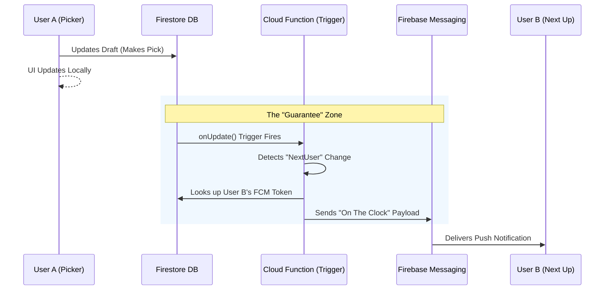

# Push Notifications Handoff Document - Draft Alerts (Refined V2)

**Project:** TopDog Best Ball Draft Alerts  
**Date:** January 2026  
**Status:** Ready for Implementation  
**Refinement Focus:** Reliability (Server-Side Triggers) & iOS PWA Compliance  
**Critical Fix:** Moved from Client-Side Triggers to Firestore Background Triggers

---

## 🚀 Key Refinements Summary

1. **Architecture Shift:** Moved from **Client-Side Trigger** (User A tells Server to notify User B) to **Firestore Trigger** (Database update automatically notifies User B). This ensures 100% reliability even if User A goes offline immediately after picking.
2. **iOS Strategy:** Clarified that for Web Push on iOS to work, the user **must** add the app to their Home Screen (PWA). This is a hard iOS constraint.
3. **UX Improvement:** Changed initialization from "Auto-load" to "User Interaction" to prevent browser blocking permissions.

---

## 🚨 Critical Architectural Fix

### The Vulnerability (Original Plan)

**Problem:** The original plan relied on the **Client** to trigger push notifications via a Callable Function (`sendDraftAlert`).

**Failure Scenario:**
1. User A makes a pick
2. Client calls `sendDraftAlert` function
3. User A immediately closes browser or loses connection
4. Function call never executes
5. **User B never receives "On The Clock" notification** ❌

### The Solution (Refined Plan)

**Fix:** Move trigger logic to **Firestore Background Triggers**. When the database changes (Source of Truth), the server automatically sends notifications.

**Guaranteed Scenario:**
1. User A makes a pick
2. Firestore document updates (guaranteed write)
3. Cloud Function trigger fires automatically
4. Server sends notification to User B
5. **User B receives notification even if User A is offline** ✅

---

## 🏗️ Refined Architecture

### The Logic Flow (Server-Driven)

Instead of the client calling a function, the Cloud Function listens to the `drafts/{draftId}` document.



### Architecture Diagram

```
┌─────────────────────────┐      ┌─────────────────────────┐
│  User Action (Client)   │      │   Server (Reliability)  │
│  - User makes pick      │      │                         │
│  - Writes to Firestore  ├─────►│  Firestore DB Update    │
└─────────────────────────┘      │            │            │
                                 │            ▼            │
                                 │  Cloud Function Trigger │
                                 │  (onDocumentUpdate)     │
                                 │            │            │
                                 │            ▼            │
                                 │    FCM Send Service     │
                                 └────────────┬────────────┘
                                              │
                        ┌─────────────────────┴───────────────────────┐
                        ▼                                             ▼
               ┌────────────────┐                            ┌────────────────┐
               │  iOS (APNs)    │                            │ Android/Web    │
               │  *Must be PWA  │                            │ (Standard FCM) │
               └────────────────┘                            └────────────────┘
```

---

## 📋 Executive Summary

This document outlines the implementation plan for true push notifications to complement the Dynamic Island alert system. The current web notification system works for sandbox testing (when browser tab is open), but we need true push notifications that work when the app is completely closed.

**Current State:**
- ✅ Web notifications work when tab is open/hidden
- ✅ Service worker integrated
- ✅ All 5 alert types supported
- ⚠️ Does NOT work when browser/app is closed

**Target State:**
- ✅ True push notifications via FCM
- ✅ **Server-side triggers** (guaranteed delivery)
- ✅ Works when app is closed
- ✅ Works on all devices (iOS, Android, Desktop)
- ✅ iOS PWA support documented

---

## 🎯 Requirements

### Functional Requirements

1. **Push notifications must work when:**
   - Browser/app is completely closed
   - Device is locked
   - User is in another app
   - **Triggering user goes offline immediately**

2. **Must support all 5 alert types:**
   - Draft Room Filled
   - Draft Starting
   - Two Picks Away
   - On The Clock
   - 10 Seconds Remaining

3. **Must respect user preferences:**
   - Individual toggles for each alert type
   - User can enable/disable push notifications

4. **Must work on all devices:**
   - iPhone (all models) - **Requires PWA installation**
   - Android phones
   - Desktop browsers
   - iPad/Tablets

### Non-Functional Requirements

- **Reliability:** 99%+ delivery rate (guaranteed by server-side triggers)
- **Latency:** < 2 seconds from database update to delivery
- **Battery:** Minimal impact
- **Cost:** Free tier acceptable (FCM unlimited)

---

## 📦 Implementation Phases

### Phase 1: Client Integration (Refined)

**Estimated Time:** 4-6 hours  
**Priority:** High (enables true push)

#### Step 1.1: Firebase Console Configuration

1. **Enable FCM:**
   - Go to Firebase Console → Project Settings → Cloud Messaging
   - Enable Firebase Cloud Messaging
   - Note your `Sender ID` and `Server Key`

2. **Web Push Certificate:**
   - Generate Web Push certificate
   - Download VAPID key pair
   - Add to environment variables

3. **iOS APNs Certificate (if needed):**
   - Upload APNs certificate for iOS push
   - Configure in Firebase Console

#### Step 1.2: Install Dependencies

```bash
# Firebase already installed, verify version
npm list firebase

# If needed, update:
npm install firebase@latest
```

#### Step 1.3: Create FCM Service (Refined)

**File:** `lib/pushNotifications/fcmService.ts`

**Critical Change:** Do not auto-initialize in `useEffect`. Browsers block permission requests not triggered by a user click.

```typescript
/**
 * Firebase Cloud Messaging Service
 * 
 * Handles FCM token subscription and foreground message handling
 * 
 * IMPORTANT: initialize() must be called from a user interaction (button click)
 * NOT from useEffect without interaction (browsers will block)
 */

import { getMessaging, getToken, onMessage, Messaging, isSupported } from 'firebase/messaging';
import { getAuth } from 'firebase/auth';
import { getFirestore, doc, setDoc, serverTimestamp } from 'firebase/firestore';
import { initializeApp, getApps, FirebaseApp } from 'firebase/app';

// FCM VAPID key from Firebase Console
const VAPID_KEY = process.env.NEXT_PUBLIC_FCM_VAPID_KEY || '';

interface FCMConfig {
  apiKey: string;
  authDomain: string;
  projectId: string;
  storageBucket: string;
  messagingSenderId: string;
  appId: string;
}

// Firebase config (should match your existing config)
const getFirebaseConfig = (): FCMConfig => {
  return {
    apiKey: process.env.NEXT_PUBLIC_FIREBASE_API_KEY || '',
    authDomain: process.env.NEXT_PUBLIC_FIREBASE_AUTH_DOMAIN || '',
    projectId: process.env.NEXT_PUBLIC_FIREBASE_PROJECT_ID || '',
    storageBucket: process.env.NEXT_PUBLIC_FIREBASE_STORAGE_BUCKET || '',
    messagingSenderId: process.env.NEXT_PUBLIC_FIREBASE_MESSAGING_SENDER_ID || '',
    appId: process.env.NEXT_PUBLIC_FIREBASE_APP_ID || '',
  };
};

class FCMService {
  private messaging: Messaging | null = null;
  private token: string | null = null;
  private app: FirebaseApp | null = null;
  private isInitialized = false;

  /**
   * Check if FCM is supported
   */
  async isSupported(): Promise<boolean> {
    if (typeof window === 'undefined') return false;
    return await isSupported();
  }

  /**
   * Initialize FCM - MUST be called from user interaction (button click)
   * NOT from useEffect without interaction
   * 
   * Browsers block permission requests that aren't triggered by user action
   */
  async requestPermissionAndGetToken(): Promise<string | null> {
    if (typeof window === 'undefined') return null;
    if (!('Notification' in window)) return null;
    if (!('serviceWorker' in navigator)) return null;

    try {
      // 1. Register Service Worker explicitly first (critical for Next.js)
      const registration = await navigator.serviceWorker.register(
        '/firebase-messaging-sw.js',
        { scope: '/' }
      );

      // 2. Wait for it to be ready
      await navigator.serviceWorker.ready;

      // 3. Check if FCM is supported
      if (!(await this.isSupported())) {
        console.warn('[FCM] Not supported on this device');
        return null;
      }

      // 4. Initialize Firebase app if not already initialized
      const config = getFirebaseConfig();
      if (getApps().length === 0) {
        this.app = initializeApp(config);
      } else {
        this.app = getApps()[0];
      }

      // 5. Get messaging instance
      this.messaging = getMessaging(this.app);

      // 6. Request notification permission (must be from user interaction)
      const permission = await Notification.requestPermission();
      if (permission !== 'granted') {
        console.warn('[FCM] Notification permission denied');
        return null;
      }

      // 7. Get FCM token using the specific service worker registration
      if (!VAPID_KEY) {
        console.warn('[FCM] VAPID key not configured');
        return null;
      }

      this.token = await getToken(this.messaging, {
        vapidKey: VAPID_KEY,
        serviceWorkerRegistration: registration, // Critical for Next.js
      });

      if (this.token) {
        await this.saveTokenToFirestore(this.token);
        console.log('[FCM] ✅ Token obtained and saved');
        this.isInitialized = true;
        return this.token;
      }

      return null;
    } catch (error) {
      console.error('[FCM] Initialization failed:', error);
      return null;
    }
  }

  /**
   * Save FCM token to user's Firestore document
   */
  private async saveTokenToFirestore(token: string): Promise<void> {
    try {
      const auth = getAuth();
      const user = auth.currentUser;
      if (!user) {
        console.warn('[FCM] No authenticated user, cannot save token');
        return;
      }

      const db = getFirestore();
      const userRef = doc(db, 'users', user.uid);

      await setDoc(
        userRef,
        {
          fcmToken: token,
          fcmTokenUpdatedAt: serverTimestamp(),
          fcmEnabled: true,
        },
        { merge: true }
      );

      console.log('[FCM] Token saved to Firestore');
    } catch (error) {
      console.error('[FCM] Failed to save token:', error);
    }
  }

  /**
   * Get current FCM token
   */
  getToken(): string | null {
    return this.token;
  }

  /**
   * Listen for foreground messages
   * These are messages received when app is open
   */
  onMessage(callback: (payload: any) => void): () => void {
    if (!this.messaging) {
      console.warn('[FCM] Messaging not initialized');
      return () => {};
    }

    const unsubscribe = onMessage(this.messaging, (payload) => {
      console.log('[FCM] Foreground message received:', payload);
      callback(payload);
    });

    return unsubscribe;
  }

  /**
   * Delete token (for logout/disable)
   */
  async deleteToken(): Promise<void> {
    if (!this.messaging || !this.token) return;

    try {
      await this.messaging.deleteToken();
      this.token = null;
      
      // Remove from Firestore
      const auth = getAuth();
      const user = auth.currentUser;
      if (user) {
        const db = getFirestore();
        const userRef = doc(db, 'users', user.uid);
        await setDoc(
          userRef,
          {
            fcmToken: null,
            fcmEnabled: false,
          },
          { merge: true }
        );
      }
    } catch (error) {
      console.error('[FCM] Failed to delete token:', error);
    }
  }
}

// Export singleton instance
export const fcmService = new FCMService();
```

#### Step 1.4: Create FCM Service Worker

**File:** `public/firebase-messaging-sw.js`

```javascript
/**
 * Firebase Cloud Messaging Service Worker
 * 
 * Handles background push notifications
 */

// Import Firebase scripts
importScripts('https://www.gstatic.com/firebasejs/10.7.1/firebase-app-compat.js');
importScripts('https://www.gstatic.com/firebasejs/10.7.1/firebase-messaging-compat.js');

// Firebase configuration (same as client)
const firebaseConfig = {
  apiKey: "YOUR_API_KEY",
  authDomain: "YOUR_AUTH_DOMAIN",
  projectId: "YOUR_PROJECT_ID",
  storageBucket: "YOUR_STORAGE_BUCKET",
  messagingSenderId: "YOUR_SENDER_ID",
  appId: "YOUR_APP_ID"
};

// Initialize Firebase
firebase.initializeApp(firebaseConfig);

// Get messaging instance
const messaging = firebase.messaging();

// Handle background messages (when app is closed)
messaging.onBackgroundMessage((payload) => {
  console.log('[FCM] Background message received:', payload);

  const notificationTitle = payload.notification?.title || 'TopDog Draft';
  const notificationBody = payload.notification?.body || payload.data?.message || 'Draft alert';
  
  const notificationOptions = {
    body: notificationBody,
    icon: '/icon-192x192.png',
    badge: '/icon-96x96.png',
    data: payload.data,
    tag: `draft-alert-${payload.data?.roomId}-${payload.data?.type}`,
    requireInteraction: payload.data?.type === 'on_the_clock',
    silent: false,
    vibrate: [200, 100, 200],
    actions: [
      {
        action: 'open',
        title: 'Open Draft',
      },
    ],
  };

  return self.registration.showNotification(notificationTitle, notificationOptions);
});

// Handle notification clicks
self.addEventListener('notificationclick', (event) => {
  console.log('[FCM] Notification clicked:', event);
  
  event.notification.close();
  
  const data = event.notification.data;
  const action = event.action;
  
  // Handle action button clicks
  if (action === 'open' || !action) {
    const urlToOpen = data?.url || `/draft/topdog/${data?.roomId}`;
    
    event.waitUntil(
      clients.matchAll({ type: 'window', includeUncontrolled: true }).then((clientList) => {
        // Focus existing window if open
        for (const client of clientList) {
          if (client.url.includes(data?.roomId) && 'focus' in client) {
            return client.focus();
          }
        }
        // Open new window
        if (clients.openWindow) {
          return clients.openWindow(urlToOpen);
        }
      })
    );
  }
});
```

#### Step 1.5: Create User Interaction UI

**File:** `components/vx2/auth/components/ProfileSettingsModal.tsx` (UPDATE)

Add FCM enable button (must be user interaction):

```typescript
// In PreferencesTabContent:
const [fcmEnabled, setFcmEnabled] = useState(
  profile?.preferences?.fcmEnabled ?? false
);
const [fcmInitializing, setFcmInitializing] = useState(false);

// Add button UI:
<div className="flex items-center justify-between p-4 rounded-xl bg-white/5">
  <div>
    <span className="block font-medium text-white">
      Push Notifications
    </span>
    <span className="text-gray-400 text-sm">
      Receive alerts even when app is closed
    </span>
    {isIOS && !window.navigator.standalone && (
      <span className="text-yellow-400 text-xs mt-1 block">
        ⚠️ Add to Home Screen to enable on iOS
      </span>
    )}
  </div>
  <button
    onClick={async () => {
      if (fcmEnabled) {
        // Disable
        await fcmService.deleteToken();
        setFcmEnabled(false);
        await updateProfile({
          preferences: {
            ...profile?.preferences,
            fcmEnabled: false,
          },
        });
      } else {
        // Enable (user interaction required)
        setFcmInitializing(true);
        try {
          const token = await fcmService.requestPermissionAndGetToken();
          if (token) {
            setFcmEnabled(true);
            await updateProfile({
              preferences: {
                ...profile?.preferences,
                fcmEnabled: true,
              },
            });
          } else {
            alert('Failed to enable push notifications. Please check browser permissions.');
          }
        } catch (error) {
          console.error('[FCM] Enable failed:', error);
          alert('Failed to enable push notifications.');
        } finally {
          setFcmInitializing(false);
        }
      }
    }}
    disabled={fcmInitializing}
    className="px-4 py-2 bg-blue-600 text-white rounded-lg hover:bg-blue-700 disabled:opacity-50"
  >
    {fcmInitializing ? 'Enabling...' : fcmEnabled ? 'Disable' : 'Enable'}
  </button>
</div>
```

---

### Phase 2: Server-Side Triggers (CRITICAL - Replaces Callable Function)

**Estimated Time:** 2-3 hours  
**Priority:** **CRITICAL** (This is the reliability fix)

#### Step 2.1: Create Firestore Trigger Function

**File:** `functions/src/draftTriggers.ts` (NEW)

**This replaces the callable function approach entirely.**

```typescript
/**
 * Firestore Triggers for Draft Alerts
 * 
 * CRITICAL: These triggers fire automatically when draft documents change.
 * This ensures notifications are sent even if the triggering user goes offline.
 */

import * as functions from 'firebase-functions';
import * as admin from 'firebase-admin';

// Initialize admin if not already initialized
if (!admin.apps.length) {
  admin.initializeApp();
}

/**
 * Trigger when a draft document is updated
 * 
 * This fires automatically whenever the draft document changes,
 * regardless of whether the triggering user is online or not.
 */
export const onDraftUpdate = functions.firestore
  .document('drafts/{draftId}')
  .onUpdate(async (change, context) => {
    const newData = change.after.data();
    const previousData = change.before.data();
    const draftId = context.params.draftId;

    console.log(`[DraftTrigger] Draft ${draftId} updated`);

    // 1. Check for "On The Clock" Change
    // Detect when currentPicker changes (user's turn starts)
    const newCurrentPicker = getCurrentPicker(newData);
    const oldCurrentPicker = getCurrentPicker(previousData);

    if (newCurrentPicker && newCurrentPicker !== oldCurrentPicker) {
      console.log(`[DraftTrigger] New picker: ${newCurrentPicker}`);
      await sendPushToUser(newCurrentPicker, {
        title: 'You are on the clock!',
        body: `It's your turn in ${newData.name || 'the draft'}`,
        type: 'on_the_clock',
        roomId: draftId,
        draftName: newData.name,
      });
    }

    // 2. Check for "Draft Started"
    if (newData.status === 'active' && previousData.status === 'waiting') {
      console.log(`[DraftTrigger] Draft ${draftId} started`);
      
      // Send to all participants
      const participants = newData.participants || [];
      const userIds = participants.map((p: any) => 
        typeof p === 'string' ? p : p.userId || p.id
      ).filter(Boolean);

      await Promise.all(
        userIds.map((userId: string) =>
          sendPushToUser(userId, {
            title: 'Draft Starting!',
            body: `The draft "${newData.name || 'room'}" is now active`,
            type: 'draft_starting',
            roomId: draftId,
            draftName: newData.name,
          })
        )
      );
    }

    // 3. Check for "Room Filled"
    const maxParticipants = newData.settings?.maxParticipants || newData.maxParticipants || 12;
    const newParticipantCount = (newData.participants || []).length;
    const oldParticipantCount = (previousData.participants || []).length;

    if (
      newParticipantCount === maxParticipants &&
      oldParticipantCount < maxParticipants
    ) {
      console.log(`[DraftTrigger] Room ${draftId} filled`);
      
      // Send to all participants
      const participants = newData.participants || [];
      const userIds = participants.map((p: any) => 
        typeof p === 'string' ? p : p.userId || p.id
      ).filter(Boolean);

      await Promise.all(
        userIds.map((userId: string) =>
          sendPushToUser(userId, {
            title: 'Draft Room Filled!',
            body: `The draft "${newData.name || 'room'}" is full and will start soon`,
            type: 'room_filled',
            roomId: draftId,
            draftName: newData.name,
          })
        )
      );
    }

    // 4. Check for "Two Picks Away"
    // This requires calculating picksUntilMyTurn for each participant
    // Implementation depends on your draft order logic
    // For now, we'll handle this in a separate trigger or calculate in the function

    // 5. Check for "10 Seconds Remaining"
    // This requires timer state in the draft document
    // If you store timerSeconds in Firestore, check here
    // Otherwise, handle client-side only
  });

/**
 * Get current picker from draft data
 * 
 * Adapt this to match your actual draft document structure
 */
function getCurrentPicker(draftData: any): string | null {
  // Option 1: If you store currentPicker directly
  if (draftData.currentPicker) {
    return typeof draftData.currentPicker === 'string'
      ? draftData.currentPicker
      : draftData.currentPicker.userId || draftData.currentPicker.id;
  }

  // Option 2: If you calculate from currentPickNumber and draftOrder
  if (draftData.currentPickNumber && draftData.draftOrder) {
    const pickIndex = (draftData.currentPickNumber - 1) % draftData.draftOrder.length;
    const pickerId = draftData.draftOrder[pickIndex];
    return typeof pickerId === 'string' ? pickerId : pickerId?.userId || pickerId?.id;
  }

  // Option 3: If you use participants array with order
  if (draftData.currentPickNumber && draftData.participants) {
    const pickIndex = (draftData.currentPickNumber - 1) % draftData.participants.length;
    const participant = draftData.participants[pickIndex];
    return typeof participant === 'string'
      ? participant
      : participant?.userId || participant?.id;
  }

  return null;
}

/**
 * Helper function to send push notification to a user
 */
async function sendPushToUser(
  userId: string,
  payload: {
    title: string;
    body: string;
    type: string;
    roomId: string;
    draftName?: string;
  }
): Promise<void> {
  try {
    // Get user's FCM token and preferences
    const userDoc = await admin.firestore().doc(`users/${userId}`).get();
    
    if (!userDoc.exists) {
      console.warn(`[DraftTrigger] User ${userId} not found`);
      return;
    }

    const userData = userDoc.data();
    const fcmToken = userData?.fcmToken;
    const fcmEnabled = userData?.fcmEnabled !== false; // Default to true
    const preferences = userData?.preferences?.draftAlerts || {};

    // Check if FCM is enabled
    if (!fcmEnabled || !fcmToken) {
      console.log(`[DraftTrigger] FCM disabled or no token for user ${userId}`);
      return;
    }

    // Check user preferences for this alert type
    const alertPreferenceKey = getAlertPreferenceKey(payload.type);
    if (preferences[alertPreferenceKey] === false) {
      console.log(`[DraftTrigger] Alert ${payload.type} disabled for user ${userId}`);
      return;
    }

    // Build FCM message
    const fcmMessage: admin.messaging.Message = {
      token: fcmToken,
      notification: {
        title: payload.title,
        body: payload.body,
      },
      data: {
        type: payload.type,
        roomId: payload.roomId,
        url: `/draft/topdog/${payload.roomId}`,
        draftName: payload.draftName || '',
        timestamp: Date.now().toString(),
      },
      // iOS-specific (APNs)
      apns: {
        payload: {
          aps: {
            sound: payload.type === 'on_the_clock' ? 'default' : undefined,
            badge: 1,
            'content-available': 1,
          },
        },
      },
      // Web/Android-specific
      webpush: {
        notification: {
          icon: '/icon-192x192.png',
          badge: '/icon-96x96.png',
          requireInteraction: payload.type === 'on_the_clock',
          vibrate: [200, 100, 200],
        },
        fcmOptions: {
          link: `/draft/topdog/${payload.roomId}`,
        },
      },
      android: {
        priority: 'high',
        notification: {
          sound: payload.type === 'on_the_clock' ? 'default' : undefined,
          channelId: 'draft_alerts',
        },
      },
    };

    // Send push notification
    const response = await admin.messaging().send(fcmMessage);
    console.log(`[DraftTrigger] ✅ Push sent to ${userId}: ${response}`);
  } catch (error: any) {
    console.error(`[DraftTrigger] ❌ Failed to send to ${userId}:`, error);

    // Handle invalid token cleanup
    if (
      error.code === 'messaging/invalid-registration-token' ||
      error.code === 'messaging/registration-token-not-registered'
    ) {
      console.log(`[DraftTrigger] Removing invalid token for user ${userId}`);
      await admin.firestore().doc(`users/${userId}`).update({
        fcmToken: admin.firestore.FieldValue.delete(),
        fcmEnabled: false,
      });
    }
  }
}

/**
 * Map alert type to preference key
 */
function getAlertPreferenceKey(alertType: string): string {
  const mapping: Record<string, string> = {
    room_filled: 'roomFilled',
    draft_starting: 'draftStarting',
    two_picks_away: 'twoPicksAway',
    on_the_clock: 'onTheClock',
    ten_seconds_remaining: 'tenSecondsRemaining',
  };
  return mapping[alertType] || alertType;
}
```

#### Step 2.2: Install Firebase Functions Dependencies

**File:** `functions/package.json`

```json
{
  "name": "functions",
  "scripts": {
    "build": "tsc",
    "serve": "npm run build && firebase emulators:start --only functions",
    "shell": "npm run build && firebase functions:shell",
    "start": "npm run shell",
    "deploy": "firebase deploy --only functions",
    "logs": "firebase functions:log"
  },
  "engines": {
    "node": "18"
  },
  "main": "lib/index.js",
  "dependencies": {
    "firebase-admin": "^12.0.0",
    "firebase-functions": "^4.5.0"
  },
  "devDependencies": {
    "typescript": "^5.0.0",
    "@types/node": "^20.0.0"
  },
  "private": true
}
```

#### Step 2.3: Export Function

**File:** `functions/src/index.ts`

```typescript
import { onDraftUpdate } from './draftTriggers';

export { onDraftUpdate };
```

---

### Phase 3: Remove Client-Side Alert Manager Push Calls

**Estimated Time:** 30 minutes  
**Priority:** High (cleanup)

#### Step 3.1: Update Alert Manager

**File:** `lib/draftAlerts/alertManager.ts` (UPDATE)

**Remove the push notification call from `triggerAlert` method:**

```typescript
// REMOVE THIS CODE (old approach):
// if (this.config?.isPushNotificationEnabled) {
//   try {
//     const functions = getFunctions();
//     const sendPush = httpsCallable(functions, 'sendDraftAlert');
//     // ... call sendPush
//   } catch (error) {
//     // ...
//   }
// }

// KEEP ONLY:
// - Local web notifications (for when tab is open)
// - Dynamic Island alerts (for iOS)
// - Push notifications are now handled by Firestore triggers
```

**Note:** The alert manager should still handle:
- Local web notifications (when tab is open)
- Dynamic Island alerts (iOS)
- Audio/haptic feedback

Push notifications for closed app are now **entirely server-side**.

---

## 📱 Platform Specifics (Critical)

### iOS Web App Constraints

**CRITICAL:** Safari on iOS does **NOT** support Push API unless the website is installed as a **PWA (Progressive Web App)**.

**Requirement:** Users on iPhone **MUST** tap "Share" → "Add to Home Screen".

**UI Implementation:**

```typescript
// Detect iOS
const isIOS = /iPad|iPhone|iPod/.test(navigator.userAgent);
const isStandalone = window.navigator.standalone === true;

// Show modal if iOS and not installed
if (isIOS && !isStandalone) {
  // Show instruction modal:
  // "To enable push notifications on iOS, please add this app to your Home Screen:
  //  1. Tap the Share button
  //  2. Select 'Add to Home Screen'
  //  3. Then return here to enable notifications"
}
```

### Android & Desktop

- ✅ Works natively in the browser without installation
- ✅ No additional setup needed

---

## 🧪 Refined Testing Plan

### 1. Test The "Disconnected Picker" Scenario (CRITICAL)

**Goal:** Verify server-side reliability.

**Setup:** Two devices (User A and User B).

**Action:**
1. User A (Picker) enables "Offline Mode" in DevTools Network tab
2. User A makes a pick (draft document updates)
3. Wait 5 seconds

**Expected Result:** User B **still** receives the "On The Clock" push notification.

**Why?** Because the Firestore write succeeded before the disconnect, and the Cloud Function trigger fires automatically on the server.

**If using old client-side trigger method:** This test would **fail** ❌

### 2. Test Deep Linking

**Goal:** Verify clicking the notification opens the exact draft room.

**Action:**
1. Close the app/browser completely on Mobile
2. Trigger a notification (via Firestore update)
3. Tap the notification

**Expected Result:** Browser opens → App loads → Redirects specifically to `/draft/topdog/{roomId}`

### 3. Test Permission Flow

**Goal:** Verify user interaction requirement.

**Action:**
1. Open app
2. Try to enable push notifications from `useEffect` (should fail)
3. Click "Enable" button (should succeed)

**Expected Result:** Permission request only works from button click, not auto-load.

---

## 📊 Environment Variables

Add to `.env.local`:

```bash
# Firebase Config (should already exist)
NEXT_PUBLIC_FIREBASE_API_KEY=your_api_key
NEXT_PUBLIC_FIREBASE_AUTH_DOMAIN=your_auth_domain
NEXT_PUBLIC_FIREBASE_PROJECT_ID=your_project_id
NEXT_PUBLIC_FIREBASE_STORAGE_BUCKET=your_storage_bucket
NEXT_PUBLIC_FIREBASE_MESSAGING_SENDER_ID=your_sender_id
NEXT_PUBLIC_FIREBASE_APP_ID=your_app_id

# FCM VAPID Key (from Firebase Console)
NEXT_PUBLIC_FCM_VAPID_KEY=your_vapid_key
```

---

## 🔧 Configuration

### Firebase Console Setup

1. **Enable Cloud Messaging:**
   - Firebase Console → Project Settings → Cloud Messaging
   - Enable Firebase Cloud Messaging

2. **Generate Web Push Certificate:**
   - Cloud Messaging → Web Push certificates
   - Generate new key pair
   - Copy VAPID key to `.env.local`

3. **iOS APNs (if needed):**
   - Cloud Messaging → Apple app configuration
   - Upload APNs certificate
   - Configure for iOS push

### Service Worker Registration

Update `next.config.js` or service worker registration to include FCM service worker:

```javascript
// In your service worker registration code:
if ('serviceWorker' in navigator) {
  navigator.serviceWorker.register('/firebase-messaging-sw.js')
    .then((registration) => {
      console.log('FCM Service Worker registered:', registration);
    });
}
```

---

## 🚨 Error Handling

### Common Issues

1. **Token Not Obtained:**
   - Check VAPID key is correct
   - Verify notification permission granted
   - Check service worker is registered
   - **Ensure initialization is from user interaction**

2. **Push Not Received:**
   - Verify token in Firestore
   - Check Cloud Function logs
   - Verify FCM configuration
   - **Check that Firestore trigger is firing**

3. **Token Invalid:**
   - Token automatically removed from Firestore
   - User needs to re-initialize FCM

4. **iOS Not Working:**
   - Verify app is added to Home Screen
   - Check `window.navigator.standalone === true`
   - Verify APNs certificate is uploaded

---

## 📈 Monitoring & Analytics

### Metrics to Track

1. **Token Subscription:**
   - Number of users with FCM tokens
   - Token refresh rate
   - Token deletion rate

2. **Push Delivery:**
   - Success rate (should be 99%+ with server-side triggers)
   - Failure reasons
   - Delivery latency

3. **User Engagement:**
   - Notification open rate
   - Click-through rate
   - Alert type preferences

### Firebase Analytics

Add analytics events:

```typescript
import { logEvent } from 'firebase/analytics';

// When push is sent (in Cloud Function)
await admin.analytics().logEvent({
  name: 'push_notification_sent',
  parameters: {
    alert_type: alertType,
    room_id: roomId,
  },
});

// When push is received (in service worker)
// Track via client-side analytics
```

---

## 🔐 Security Considerations

1. **Token Security:**
   - Tokens stored in Firestore (user document)
   - Only accessible by authenticated user
   - Tokens deleted on logout

2. **Function Security:**
   - Firestore triggers are server-side only
   - No client can trigger them directly
   - Automatic execution on document update

3. **Data Privacy:**
   - No sensitive data in push payload
   - Room ID only (not user data)
   - User preferences respected

---

## 📝 Implementation Checklist

### Phase 1: FCM Setup
- [ ] Enable FCM in Firebase Console
- [ ] Generate VAPID key
- [ ] Add VAPID key to environment variables
- [ ] Create `lib/pushNotifications/fcmService.ts`
- [ ] Create `public/firebase-messaging-sw.js`
- [ ] Add user interaction UI for FCM enable
- [ ] Test token subscription
- [ ] Test foreground messages

### Phase 2: Server-Side Triggers (CRITICAL)
- [ ] Set up Firebase Functions
- [ ] Create `functions/src/draftTriggers.ts`
- [ ] Implement `onDraftUpdate` trigger
- [ ] Implement `getCurrentPicker` helper (adapt to your schema)
- [ ] Deploy Cloud Function
- [ ] Test "disconnected picker" scenario
- [ ] Test all 5 alert types

### Phase 3: Cleanup
- [ ] Remove client-side push calls from alert manager
- [ ] Update documentation
- [ ] Test end-to-end flow

---

## 🎯 Success Criteria

- [ ] FCM token obtained for 90%+ of users
- [ ] Push notifications delivered with <2s latency
- [ ] **99%+ delivery success rate** (guaranteed by server-side triggers)
- [ ] Works on all target devices
- [ ] User preferences respected
- [ ] **"Disconnected picker" test passes** ✅
- [ ] No battery drain issues

---

## 🏁 Final Recommendation

**Proceed with Phase 1 (Client) immediately, but adopt the Firestore Trigger (Phase 2) architecture from day one.**

**Do NOT implement client-side callable functions for notifications**, as they will lead to "phantom" missed picks and user frustration.

**The server-side trigger approach is:**
- ✅ More reliable (guaranteed execution)
- ✅ Simpler (no client-side push logic needed)
- ✅ More scalable (handles all users automatically)
- ✅ Better UX (works even if triggering user goes offline)

---

## 📚 References

- [Firebase Cloud Messaging Docs](https://firebase.google.com/docs/cloud-messaging)
- [Firestore Triggers](https://firebase.google.com/docs/functions/firestore-events)
- [Web Push Protocol](https://web.dev/push-notifications-overview/)
- [Service Worker API](https://developer.mozilla.org/en-US/docs/Web/API/Service_Worker_API)
- [iOS PWA Push Notifications](https://webkit.org/blog/13878/web-push-for-web-apps-on-ios-and-ipados/)

---

**Status:** Plan complete with critical architectural fix. Ready for implementation.
