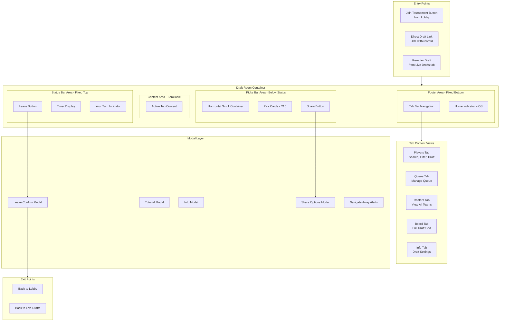

# TopDog Master Glossary & Architecture Blueprint

> **Philosophy**: Maniacally thorough. Every screen. Every element. Every pixel. Every state. Every action. Every platform difference. Documented so comprehensively that any developer can build any part of this app on any platform using only this glossary.

---

## Table of Contents

1. [Project Overview](#project-overview)
2. [Deliverables](#deliverables)
3. [Master Spreadsheet Schema](#master-spreadsheet-schema)
4. [Element Documentation Template](#element-documentation-template)
5. [Module 1: Draft Room](#module-1-draft-room-current-focus)
6. [Module 2: Lobby/Home](#module-2-lobbyhome)
7. [Module 3: My Teams](#module-3-my-teams)
8. [Module 4: Live/Slow Drafts](#module-4-liveslow-drafts)
9. [Module 5: Auth](#module-5-auth)
10. [Module 6: Settings/Profile](#module-6-settingsprofile)
11. [Module 7: Payments](#module-7-payments)
12. [Module 8: Onboarding](#module-8-onboarding)
13. [Module 9: Navigation Shell](#module-9-navigation-shell)
14. [Execution Strategy](#execution-strategy)
15. [Success Criteria](#success-criteria)

---

## Project Overview

### What This Is

A comprehensive, platform-agnostic "product blueprint" for the entire TopDog application. This is NOT code documentation - this is PRODUCT documentation that describes what the app IS and HOW it works, independent of any specific implementation.

### Why We're Doing This

1. **Cross-Platform Development**: Build iOS, Android, iPad, web apps from a single source of truth
2. **Pixel-Perfect Consistency**: Ensure every platform matches exactly
3. **Maintainability**: Future developers can understand every element
4. **Tech Debt Discovery**: Systematically find and document issues
5. **Architecture Decisions**: Record WHY things are the way they are

### Modules Overview


| Module | Area             | Description                                         | Element Count | Complexity | Status      |
| ------ | ---------------- | --------------------------------------------------- | ------------- | ---------- | ----------- |
| 1      | **Draft Room**   | Live drafting experience - the core product         | ~70           | High       | **Current** |
| 2      | Lobby/Home       | Tournament discovery, featured contests, entry flow | ~25           | Medium     | Pending     |
| 3      | My Teams         | Drafted teams list, team details, live standings    | ~30           | Medium     | Pending     |
| 4      | Live/Slow Drafts | Active draft management, your turn alerts           | ~25           | Medium     | Pending     |
| 5      | Auth             | Login, registration, password reset, verification   | ~35           | Medium     | Pending     |
| 6      | Settings/Profile | User preferences, notifications, account management | ~30           | Low        | Pending     |
| 7      | Payments         | Deposits, withdrawals, transaction history          | ~40           | High       | Pending     |
| 8      | Onboarding       | First-time user flow, tutorials, permissions        | ~20           | Low        | Pending     |
| 9      | Navigation Shell | Tab bar, headers, global elements, safe areas       | ~25           | Low        | Pending     |


**Total Elements: ~300+**

---

## Deliverables

### 1. Glossary Web App (localhost:3000/glossary)

A fully interactive design system explorer accessible at `/glossary` in the Next.js app.

**Features:**

- **Searchable**: Search across all ~300 elements
- **Filterable**: Filter by module, screen, component, element type
- **Interactive**: Click any element to see full details
- **Visual**: Screenshots inline for every state
- **Wireframe Context View**: For each element, show a phone wireframe where:
  - The current element is rendered as the ACTUAL component (real, highlighted)
  - All OTHER elements on that screen are shown as wireframe outlines
  - Helps visualize exactly where each element appears in context

**Wireframe Context Example:**

```
┌─────────────────────────────┐
│  📱 iPhone Frame            │
│  ┌───────────────────────┐  │
│  │ ░░░░░░░░░░░░░░░░░░░░░ │  │  ← StatusBar (wireframed)
│  │ ░░░░░░░░░░░░░░░░░░░░░ │  │  ← PicksBar (wireframed)
│  │                       │  │
│  │  ┌─────────────────┐  │  │
│  │  │ 🔍 Search...    │  │  │  ← ACTUAL Search Bar (real component)
│  │  └─────────────────┘  │  │
│  │                       │  │
│  │ ░░░░░░░░░░░░░░░░░░░░░ │  │  ← Player rows (wireframed)
│  │ ░░░░░░░░░░░░░░░░░░░░░ │  │
│  │                       │  │
│  │ ░░░░░░░░░░░░░░░░░░░░░ │  │  ← Footer (wireframed)
│  └───────────────────────┘  │
└─────────────────────────────┘
```

**File Structure:**

```
pages/
└── glossary/
    ├── index.tsx                    # Main glossary page (search, filters, list)
    ├── [elementId].tsx              # Individual element detail page
    └── module/
        └── [moduleId].tsx           # Module overview page

components/
└── glossary/
    ├── GlossaryLayout.tsx           # Layout wrapper
    ├── ElementCard.tsx              # Element preview card
    ├── ElementDetail.tsx            # Full element documentation
    ├── WireframePhone.tsx           # Phone frame with wireframe capability
    ├── WireframeElement.tsx         # Generic wireframe placeholder
    ├── SearchBar.tsx                # Search functionality
    ├── FilterPanel.tsx              # Module/screen/type filters
    └── contexts/
        └── [ComponentName]Context.tsx  # Context view for each component

lib/
└── glossary/
    ├── elements.ts                  # All element data (generated from documentation)
    ├── types.ts                     # TypeScript types for glossary
    └── search.ts                    # Search indexing
```

### 2. Element Data Store

All element documentation stored as TypeScript/JSON for the web app to consume.

Location: `lib/glossary/elements.ts`

```typescript
// Example structure
export const elements: GlossaryElement[] = [
  {
    id: 'DR-SB-001',
    name: 'Leave Button',
    module: 'draft-room',
    screen: 'all',
    parent: 'StatusBar',
    position: { x: 12, y: 28 },
    dimensions: { width: 44, height: 44 },
    // ... all other fields
    wireframeContext: {
      screen: 'draft-room-players',
      highlightBounds: { x: 12, y: 28, width: 44, height: 44 },
      siblingElements: ['DR-SB-002', 'DR-SB-003', ...] // These get wireframed
    }
  },
  // ... ~300 elements
];
```

### 3. Architecture Documents (Per Module)

Markdown documentation for detailed reading, linked from the web app.

```
docs/glossary/
├── README.md                        # Overview, how to use
├── draft-room/
│   ├── ARCHITECTURE.md              # Diagrams + element dictionary
│   ├── TECH_DEBT.md                 # Issues and remediation
│   ├── PLATFORM_COMPARISON.md       # Web vs iOS differences
│   └── components/
│       ├── StatusBar.md
│       ├── PicksBar.md
│       └── ...
├── lobby/
├── my-teams/
├── live-slow-drafts/
├── auth/
├── settings/
├── payments/
├── onboarding/
└── navigation-shell/
```

### 4. Screenshots Archive

Every element, every state, captured from the live app.

Location: `public/glossary/screenshots/` (accessible via web)

### 5. Master Spreadsheet (Optional Export)

CSV/Excel export of all elements for external use.

Location: `docs/glossary/MASTER_GLOSSARY.csv`

---

## Wireframe Phone System Architecture

### Concept

For each element in the glossary, show a phone mockup where:

- **The current element** is rendered as the REAL component (actual colors, actual content)
- **All sibling elements** on the same screen are rendered as WIREFRAMES (gray outlines, placeholder shapes)
- This provides context - you can see exactly WHERE the element lives

### Screen Definitions

Each screen in the app needs a wireframe layout definition:

```typescript
// lib/glossary/screens.ts

export const screens: ScreenDefinition[] = [
  {
    id: 'draft-room-players',
    name: 'Draft Room - Players Tab',
    module: 'draft-room',
    layout: {
      statusBar: { x: 0, y: 0, width: '100%', height: 54 },
      picksBar: { x: 0, y: 54, width: '100%', height: 130 },
      content: { x: 0, y: 184, width: '100%', height: 'calc(100% - 240px)' },
      footer: { x: 0, y: 'bottom', width: '100%', height: 56 }
    },
    elements: [
      'DR-SB-001', 'DR-SB-002', 'DR-SB-003', 'DR-SB-004', 'DR-SB-005',  // StatusBar
      'DR-PB-001', 'DR-PB-002', 'DR-PB-003', 'DR-PB-004', 'DR-PB-005', 'DR-PB-006',  // PicksBar
      'DR-PL-001', 'DR-PL-002', /* ... all Players Tab elements */
      'DR-FT-001', 'DR-FT-002', 'DR-FT-003', 'DR-FT-004', 'DR-FT-005', 'DR-FT-006', 'DR-FT-007'  // Footer
    ]
  },
  {
    id: 'draft-room-queue',
    name: 'Draft Room - Queue Tab',
    module: 'draft-room',
    // ... similar structure
  },
  // ... all screens
];
```

### WireframePhone Component

```typescript
// components/glossary/WireframePhone.tsx

interface WireframePhoneProps {
  screenId: string;           // Which screen layout to use
  highlightElementId: string; // Which element to render as REAL
  deviceType?: 'iphone15' | 'iphone15pro' | 'iphone16promax';
}

export function WireframePhone({ screenId, highlightElementId, deviceType = 'iphone15' }: WireframePhoneProps) {
  const screen = screens.find(s => s.id === screenId);
  const highlightElement = elements.find(e => e.id === highlightElementId);
  
  return (
    <div className={styles.phoneFrame} style={getDeviceDimensions(deviceType)}>
      <div className={styles.screen}>
        {screen.elements.map(elementId => {
          const element = elements.find(e => e.id === elementId);
          
          if (elementId === highlightElementId) {
            // Render the REAL component
            return (
              <div 
                key={elementId}
                className={styles.highlightedElement}
                style={getElementPosition(element)}
              >
                <RealElementRenderer element={element} />
              </div>
            );
          } else {
            // Render as wireframe
            return (
              <WireframeElement 
                key={elementId}
                element={element}
                style={getElementPosition(element)}
              />
            );
          }
        })}
      </div>
    </div>
  );
}
```

### WireframeElement Component

Generic wireframe placeholder that can represent any element:

```typescript
// components/glossary/WireframeElement.tsx

interface WireframeElementProps {
  element: GlossaryElement;
  style: React.CSSProperties;
}

export function WireframeElement({ element, style }: WireframeElementProps) {
  return (
    <div 
      className={styles.wireframe}
      style={{
        ...style,
        width: element.dimensions.width,
        height: element.dimensions.height,
        borderRadius: element.borderRadius || 0,
      }}
    >
      {/* Optional: Show element name on hover */}
      <span className={styles.label}>{element.name}</span>
    </div>
  );
}
```

**Wireframe styling:**

```css
.wireframe {
  background: rgba(128, 128, 128, 0.1);
  border: 1px dashed rgba(128, 128, 128, 0.5);
  position: absolute;
}

.highlightedElement {
  position: absolute;
  box-shadow: 0 0 0 3px #007AFF, 0 0 20px rgba(0, 122, 255, 0.3);
  border-radius: inherit;
  z-index: 10;
}
```

### Screen List for Each Module

**Module 1: Draft Room** (5 main screens + 5 modals)

- `draft-room-players` - Players tab active
- `draft-room-queue` - Queue tab active
- `draft-room-rosters` - Rosters tab active
- `draft-room-board` - Board tab active
- `draft-room-info` - Info tab active
- `draft-room-leave-modal` - Leave modal open
- `draft-room-tutorial-modal` - Tutorial modal open
- `draft-room-info-modal` - Info modal open
- `draft-room-share-modal` - Share modal open
- `draft-room-alerts-modal` - Alerts modal open

**Module 2: Lobby** (2 screens)

- `lobby-main` - Tournament list
- `lobby-join-modal` - Join tournament modal open

**Module 3: My Teams** (3 screens)

- `my-teams-list` - Team list view
- `my-teams-detail` - Team detail view
- `my-teams-board-modal` - Draft board modal open

**Module 4: Live/Slow Drafts** (2 screens)

- `drafts-fast` - Fast drafts tab
- `drafts-slow` - Slow drafts tab

**Module 5: Auth** (4 screens)

- `auth-gate` - Initial auth gate
- `auth-login` - Login screen
- `auth-signup` - Sign up screen
- `auth-forgot` - Forgot password modal

**Module 6: Settings** (3 screens)

- `settings-profile` - Profile tab
- `settings-autodraft` - Autodraft limits
- `settings-customization` - Customization page

**Module 7: Payments** (4 screens)

- `payments-deposit` - Deposit modal
- `payments-withdraw` - Withdraw modal
- `payments-methods` - Payment methods modal
- `payments-history` - Transaction history

**Module 8: Onboarding** (5 screens)

- `onboarding-page-1` through `onboarding-page-5`

**Module 9: Navigation Shell** (2 screens)

- `shell-main` - Main app with tab bar
- `shell-loading` - Full screen loading state

**Total: ~35 screen definitions**

---

## Master Spreadsheet Schema

Every row represents ONE element. Columns:


| Column                   | Description               | Example                                                          |
| ------------------------ | ------------------------- | ---------------------------------------------------------------- |
| **Element ID**           | Unique identifier         | `DR-SB-001` (Draft Room - Status Bar - 001)                      |
| **Element Name**         | Human-readable name       | "Leave Button"                                                   |
| **Module**               | Which module              | "Draft Room"                                                     |
| **Screen/Tab**           | Which screen              | "All (visible in all tabs)"                                      |
| **Parent Container**     | What contains this        | "StatusBar"                                                      |
| **Position X (px)**      | From left edge            | `12`                                                             |
| **Position Y (px)**      | From top edge             | `28` (below Dynamic Island)                                      |
| **Width (px)**           | Element width             | `44`                                                             |
| **Height (px)**          | Element height            | `44`                                                             |
| **Padding**              | Internal spacing          | `0`                                                              |
| **Margin**               | External spacing          | `0`                                                              |
| **Font Family**          | If text                   | "SF Pro Display"                                                 |
| **Font Size (px)**       | If text                   | N/A                                                              |
| **Font Weight**          | If text                   | N/A                                                              |
| **Line Height**          | If text                   | N/A                                                              |
| **Border Radius (px)**   | Corner rounding           | `22` (circular)                                                  |
| **Border Width**         | Border thickness          | `0`                                                              |
| **Border Color**         | Border color              | N/A                                                              |
| **Background Color**     | Fill color                | `rgba(0,0,0,0.3)`                                                |
| **Text Color**           | If text                   | N/A                                                              |
| **Icon**                 | If icon                   | "X" / Close icon                                                 |
| **Icon Size (px)**       | Icon dimensions           | `24x24`                                                          |
| **Icon Color**           | Icon fill                 | `#FFFFFF`                                                        |
| **Interactive?**         | Yes/No                    | Yes                                                              |
| **Action**               | What happens on tap       | "Opens Leave Confirm Modal"                                      |
| **State: Default**       | Default appearance        | "Semi-transparent dark circle with white X"                      |
| **State: Pressed**       | On press                  | "Darker background, scale to 0.95"                               |
| **State: Disabled**      | If disabled               | N/A (always active)                                              |
| **State: Loading**       | If loading                | N/A                                                              |
| **State: Error**         | If error                  | N/A                                                              |
| **State: Success**       | If success                | N/A                                                              |
| **Animation**            | Any animations            | "Press: scale(0.95) 100ms ease-out"                              |
| **Accessibility Label**  | Screen reader text        | "Leave draft room"                                               |
| **Accessibility Role**   | ARIA role                 | "button"                                                         |
| **Appears In**           | All screens where visible | "All tabs, all draft states"                                     |
| **Visibility Condition** | When shown/hidden         | "Always visible"                                                 |
| **Z-Index**              | Stacking order            | `100`                                                            |
| **Web Component**        | React component path      | `components/vx2/draft-room/components/DraftStatusBar.tsx`        |
| **Web CSS**              | CSS file path             | `components/vx2/draft-room/components/DraftStatusBar.module.css` |
| **Web Line Numbers**     | Relevant code lines       | `L45-L67`                                                        |
| **iOS Component**        | Swift file path           | `TopDog-iOS/TopDog/Features/Draft/Views/DraftRoomView.swift`     |
| **iOS Line Numbers**     | Relevant code lines       | `L120-L145`                                                      |
| **Platform Delta**       | Differences               | "iOS: 48px diameter, Web: 44px"                                  |
| **Tech Debt Notes**      | Issues found              | "Hardcoded color should use constant"                            |
| **Screenshot: Default**  | Link to screenshot        | `screenshots/draft-room/status-bar/leave-button-default.png`     |
| **Screenshot: Pressed**  | Link to screenshot        | `screenshots/draft-room/status-bar/leave-button-pressed.png`     |
| **Last Updated**         | Date                      | `2026-02-04`                                                     |
| **Updated By**           | Who                       | "Claude"                                                         |


---

## Element Documentation Template

For EVERY element, create a documentation entry following this template:

```markdown
## [Element ID]: [Element Name]

### Overview

**What It Is**: [Detailed plain English description of what this element is and its purpose]

**Where It Appears**: 
- Module: [Module name]
- Screen(s): [List all screens where this appears]
- Parent Container: [What component contains this]
- Visibility: [Always visible / Conditional - explain when]

### Visual Specifications

**Dimensions**:
- Width: [X]px
- Height: [X]px
- Position: X=[X]px, Y=[X]px (from top-left of parent)

**Spacing**:
- Padding: [top] [right] [bottom] [left]
- Margin: [top] [right] [bottom] [left]

**Typography** (if applicable):
- Font Family: [font]
- Font Size: [X]px
- Font Weight: [weight]
- Line Height: [X]
- Text Color: [color]

**Shape & Border**:
- Border Radius: [X]px
- Border Width: [X]px
- Border Color: [color]
- Background Color: [color]

**Icon** (if applicable):
- Icon: [name/description]
- Icon Size: [X]x[X]px
- Icon Color: [color]

### Interaction

**Is Interactive**: Yes/No

**User Actions**:
1. **[Action Name]** (e.g., "Tap")
   - **Gesture**: [What the user does]
   - **Result**: [What happens]
   - **Animation**: [Any visual feedback]
   - **Sound**: [Any audio feedback]
   - **Haptic**: [Any haptic feedback]

### States

**Default State**:
- Description: [What it looks like normally]
- Screenshot: [link]

**Pressed/Active State**:
- Description: [What it looks like when pressed]
- Visual Changes: [What changes]
- Screenshot: [link]

**Disabled State** (if applicable):
- Description: [What it looks like when disabled]
- When Disabled: [Conditions]
- Screenshot: [link]

**Loading State** (if applicable):
- Description: [What it looks like when loading]
- Screenshot: [link]

**Error State** (if applicable):
- Description: [What it looks like on error]
- Screenshot: [link]

**Success State** (if applicable):
- Description: [What it looks like on success]
- Screenshot: [link]

### Accessibility

- **Label**: [Screen reader text]
- **Role**: [ARIA role]
- **Keyboard Navigation**: [Tab order, shortcuts]
- **Focus Indicator**: [What happens on focus]

### Animation

- **Entry Animation**: [How it appears]
- **Exit Animation**: [How it disappears]
- **State Transitions**: [Animations between states]
- **Duration**: [Timing]
- **Easing**: [Easing function]

### Related Elements

- **Triggers**: [What this element opens/activates]
- **Triggered By**: [What opens/activates this element]
- **Siblings**: [Other elements at same level]
- **Children**: [Elements contained within this]

### Code References

**Web (React/TypeScript)**:
- Component: `[file path]`
- Lines: [start]-[end]
- CSS: `[file path]`
- CSS Lines: [start]-[end]

**iOS (Swift/SwiftUI)**:
- View: `[file path]`
- Lines: [start]-[end]

### Platform Differences

| Aspect | Web | iOS | Notes |
|--------|-----|-----|-------|
| Width | [X]px | [X]px | [difference explanation] |
| Height | [X]px | [X]px | |
| Color | [color] | [color] | |
| [etc.] | | | |

### Tech Debt & Issues

- [ ] Issue 1: [Description] - Priority: [P0/P1/P2]
- [ ] Issue 2: [Description] - Priority: [P0/P1/P2]

### Screenshots

| State | Web | iOS |
|-------|-----|-----|
| Default | [link] | [link] |
| Pressed | [link] | [link] |
| [etc.] | | |

### Changelog

| Date | Change | By |
|------|--------|-----|
| [date] | Initial documentation | [name] |
```

---

## Module 1: Draft Room (Current Focus)

### Overview

The Draft Room is the core product - where users participate in live fantasy football drafts. It's the most complex module with the most elements and states.

### Architecture Diagram




### Screen States

The Draft Room has multiple states based on draft progress:

1. **Loading**: Initial load, fetching draft data
2. **Pre-Draft Waiting**: Countdown to draft start
3. **Active - Your Turn**: User's turn to pick
4. **Active - Waiting**: Another participant's turn
5. **Paused**: Draft temporarily paused
6. **Complete**: All picks made, draft finished

### Element Groups for Parallel Processing

#### Group A: Status Bar (5 elements)


| Element ID | Element Name        | Priority |
| ---------- | ------------------- | -------- |
| DR-SB-001  | Leave Button        | P0       |
| DR-SB-002  | Timer Display       | P0       |
| DR-SB-003  | Timer Background    | P1       |
| DR-SB-004  | Your Turn Indicator | P0       |
| DR-SB-005  | Pre-Draft Countdown | P1       |


**Files to analyze**:

- Web: `components/vx2/draft-room/components/DraftStatusBar.tsx`
- Web CSS: `components/vx2/draft-room/components/DraftStatusBar.module.css`
- iOS: `TopDog-iOS/TopDog/Features/Draft/Components/DraftTimer.swift`

**Detailed Element Specifications**:

##### DR-SB-001: Leave Button

**What It Is**: A circular button in the top-left corner that allows users to exit the draft room. This is the primary escape mechanism from the draft.

**Where It Appears**:

- Module: Draft Room
- Screen(s): All tabs (Players, Queue, Rosters, Board, Info)
- Parent Container: DraftStatusBar
- Visibility: Always visible in all draft states

**Visual Specifications**:

- Width: 44px (touch target minimum)
- Height: 44px
- Position: X=12px, Y=28px (below Dynamic Island safe area)
- Border Radius: 22px (fully circular)
- Background: rgba(0, 0, 0, 0.3) - semi-transparent dark
- Icon: "X" close icon
- Icon Size: 24px
- Icon Color: #FFFFFF

**Interaction**:

- **Tap**: Opens Leave Confirm Modal
  - If draft not started: Shows "Withdraw" option with refund info
  - If draft in progress: Shows "Leave Draft" warning about auto-pick
  - If draft complete: Navigates directly (no modal)

**States**:

- Default: Semi-transparent dark circle, white X icon
- Pressed: Background darkens to rgba(0,0,0,0.5), scale to 0.95
- Disabled: N/A (always active)

**Accessibility**:

- Label: "Leave draft room"
- Role: button
- Keyboard: Accessible via Tab, activated with Enter/Space

**Related Elements**:

- Triggers: Leave Confirm Modal, Navigate Away Alerts Modal (first time)
- Parent: DraftStatusBar

##### DR-SB-002: Timer Display

**What It Is**: The countdown timer showing seconds remaining in the current pick. Central to the draft experience.

**Where It Appears**:

- Module: Draft Room
- Screen(s): All tabs
- Parent Container: DraftStatusBar
- Visibility: Visible when draft is active

**Visual Specifications**:

- Width: Auto (text width)
- Height: 32px
- Position: Centered horizontally
- Font Family: SF Pro Display / System
- Font Size: 24px
- Font Weight: Bold (700)
- Text Color: Changes based on urgency:
  - Normal (>10s): #FFFFFF
  - Warning (5-10s): #FFA500 (orange)
  - Critical (<5s): #FF0000 (red)

**States**:

- Normal: White text, no animation
- Warning: Orange text, subtle pulse animation
- Critical: Red text, faster pulse, shake animation on expiry
- Expired: Triggers auto-pick, shake animation

**Animation**:

- Warning Pulse: scale(1.0) → scale(1.05) → scale(1.0), 500ms
- Critical Pulse: scale(1.0) → scale(1.1) → scale(1.0), 250ms
- Shake: translateX(-4px, 4px), rotate(-2deg, 2deg), 200ms

##### DR-SB-003: Timer Background

**What It Is**: The background container for the timer area that changes color based on urgency.

**Visual Specifications**:

- Width: 100% of status bar
- Height: 54px (full status bar height)
- Background: Gradient based on state:
  - Normal: Linear gradient from #1E3A5F to #2A4A6F
  - Warning: Linear gradient from #8B4513 to #A0522D
  - Critical: Linear gradient from #8B0000 to #A52A2A

##### DR-SB-004: Your Turn Indicator

**What It Is**: Text indicator that appears when it's the user's turn to make a pick.

**Visual Specifications**:

- Text: "YOUR TURN"
- Font Size: 12px
- Font Weight: Bold
- Text Color: #FFFFFF
- Background: rgba(0, 255, 0, 0.2) pill shape
- Padding: 4px 12px
- Border Radius: 12px

**Visibility**: Only shown when `isMyTurn === true` and `status === 'active'`

##### DR-SB-005: Pre-Draft Countdown

**What It Is**: Countdown display shown before the draft starts, showing time until first pick.

**Visual Specifications**:

- Text: "Draft starts in X:XX"
- Font Size: 16px
- Font Weight: Medium
- Text Color: #FFFFFF
- Position: Center of status bar

**Visibility**: Only shown when `status === 'waiting'`

---

#### Group B: Picks Bar (6 elements)


| Element ID | Element Name             | Priority |
| ---------- | ------------------------ | -------- |
| DR-PB-001  | Picks Bar Container      | P0       |
| DR-PB-002  | Pick Card - Completed    | P0       |
| DR-PB-003  | Pick Card - Current      | P0       |
| DR-PB-004  | Pick Card - Future/Blank | P1       |
| DR-PB-005  | Pick Card - User's Pick  | P0       |
| DR-PB-006  | Share Button             | P1       |


**Files to analyze**:

- Web: `components/vx2/draft-room/components/PicksBar.tsx`
- Web: `components/vx2/draft-room/components/PicksBarCard.tsx`
- Web CSS: `components/vx2/draft-room/components/PicksBar.module.css`
- Web CSS: `components/vx2/draft-room/components/PicksBarCard.module.css`
- iOS: `TopDog-iOS/TopDog/Features/Draft/Views/DraftRoomView.swift` (picksBarSection)

**Detailed Element Specifications**:

##### DR-PB-001: Picks Bar Container

**What It Is**: Horizontal scrolling container that displays all 216 picks (12 teams × 18 rounds) as cards.

**Visual Specifications**:

- Width: 100% of screen
- Height: 130px (DRAFT_LAYOUT.picksBarHeight)
- Position: Below status bar (Y = 54px)
- Padding: 8px 12px
- Background: Transparent (uses parent background)
- Scroll: Horizontal, snaps to cards
- Gap between cards: 8px

**Behavior**:

- Auto-scrolls to current pick when pick changes
- Smooth scroll animation
- Scroll position preserved when switching tabs

##### DR-PB-002: Pick Card - Completed

**What It Is**: A card showing a completed pick with player information.

**Visual Specifications**:

- Width: 140px (pickCardWidth)
- Height: 172px (pickCardHeight)
- Border Radius: 8px
- Background: Team-specific gradient based on NFL team
- Border: 2px solid (team color)

**Content Layout**:

- Header (top): Pick number, round indicator
- Player Info: First name, last name (bold), position badge
- Team Logo: Small team logo
- Position Badge: Colored by position (QB=red, RB=green, WR=blue, TE=orange)

##### DR-PB-003: Pick Card - Current

**What It Is**: The highlighted card for the current pick being made.

**Visual Specifications**:

- Same dimensions as completed card
- Background: Animated gradient or glow effect
- Border: 3px solid gold/yellow (#FFD700)
- Label: "ON THE CLOCK" text
- Timer: Mini timer display in card

**Animation**:

- Pulsing glow: box-shadow animation
- Scale: slightly larger (1.02x) than other cards

##### DR-PB-004: Pick Card - Future/Blank

**What It Is**: Placeholder cards for picks not yet made.

**Visual Specifications**:

- Same dimensions
- Background: Dark semi-transparent with subtle pattern
- Content: Pick number only
- Pattern: 4px diagonal stripes

##### DR-PB-005: Pick Card - User's Pick

**What It Is**: Cards for picks belonging to the current user's team, with special styling.

**Visual Specifications**:

- Additional border or glow to distinguish
- "YOUR PICK" label if current
- Different background treatment

##### DR-PB-006: Share Button

**What It Is**: Button to share the picks bar as an image.

**Visual Specifications**:

- Position: Bottom-right corner of picks bar
- Size: 36px × 36px
- Border Radius: 18px (circular)
- Background: rgba(255,255,255,0.9)
- Icon: Share icon, 18px
- Offset: 8px from bottom, 8px from right

**Action**: Opens Share Options Modal with generated image

---

#### Group C: Players Tab (16 elements)


| Element ID | Element Name                  | Priority |
| ---------- | ----------------------------- | -------- |
| DR-PL-001  | Search Bar Container          | P0       |
| DR-PL-002  | Search Input Field            | P0       |
| DR-PL-003  | Search Clear Button           | P1       |
| DR-PL-004  | Position Filter - QB          | P0       |
| DR-PL-005  | Position Filter - RB          | P0       |
| DR-PL-006  | Position Filter - WR          | P0       |
| DR-PL-007  | Position Filter - TE          | P0       |
| DR-PL-008  | Sort Dropdown                 | P1       |
| DR-PL-009  | Player Row Container          | P0       |
| DR-PL-010  | Player Row - Position Badge   | P0       |
| DR-PL-011  | Player Row - Name             | P0       |
| DR-PL-012  | Player Row - Team             | P1       |
| DR-PL-013  | Player Row - ADP              | P1       |
| DR-PL-014  | Player Row - Projected Points | P1       |
| DR-PL-015  | Player Row - Draft Button     | P0       |
| DR-PL-016  | Player Row - Queue Toggle     | P0       |


**Files to analyze**:

- Web: `components/vx2/draft-room/components/PlayerList.tsx`
- Web: `components/vx2/draft-room/components/VirtualizedPlayerList.tsx`
- Web CSS: `components/vx2/draft-room/components/PlayerList.module.css`
- iOS: `TopDog-iOS/TopDog/Features/Draft/Components/PlayerList.swift`

---

#### Group D: Players Tab - Expanded Card (8 elements)


| Element ID | Element Name            | Priority |
| ---------- | ----------------------- | -------- |
| DR-PE-001  | Expanded Card Container | P0       |
| DR-PE-002  | Player Header           | P0       |
| DR-PE-003  | Stats Table             | P1       |
| DR-PE-004  | Historical Stats        | P2       |
| DR-PE-005  | Draft Button (Large)    | P0       |
| DR-PE-006  | Queue Toggle (Large)    | P0       |
| DR-PE-007  | Close Button            | P1       |
| DR-PE-008  | Bye Week Display        | P2       |


**Files to analyze**:

- Web: `components/vx2/draft-room/components/PlayerExpandedCard.tsx`
- Web CSS: `components/vx2/draft-room/components/PlayerExpandedCard.module.css`

---

#### Group E: Queue Tab (9 elements)


| Element ID | Element Name         | Priority |
| ---------- | -------------------- | -------- |
| DR-QU-001  | Queue Container      | P0       |
| DR-QU-002  | Queue Header         | P1       |
| DR-QU-003  | Queue Item Row       | P0       |
| DR-QU-004  | Drag Handle          | P0       |
| DR-QU-005  | Queue Position Badge | P1       |
| DR-QU-006  | Queue Player Name    | P0       |
| DR-QU-007  | Remove Button        | P0       |
| DR-QU-008  | Empty State          | P1       |
| DR-QU-009  | Add Players Button   | P1       |


**Files to analyze**:

- Web: `components/vx2/draft-room/components/QueueView.tsx`
- Web CSS: `components/vx2/draft-room/components/QueueView.module.css`
- iOS: `TopDog-iOS/TopDog/Features/Draft/Components/QueuePanel.swift`

---

#### Group F: Rosters Tab (10 elements)


| Element ID | Element Name               | Priority |
| ---------- | -------------------------- | -------- |
| DR-RO-001  | Rosters Container          | P0       |
| DR-RO-002  | Participant Selector       | P0       |
| DR-RO-003  | Selector Dropdown Menu     | P0       |
| DR-RO-004  | Dropdown Item              | P1       |
| DR-RO-005  | Roster Grid                | P0       |
| DR-RO-006  | Roster Row - Position Slot | P0       |
| DR-RO-007  | Roster Row - Player Info   | P0       |
| DR-RO-008  | Starter Section            | P1       |
| DR-RO-009  | Bench Section              | P1       |
| DR-RO-010  | Share Button               | P1       |


**Files to analyze**:

- Web: `components/vx2/draft-room/components/RosterView.tsx`
- Web CSS: `components/vx2/draft-room/components/RosterView.module.css`
- iOS: `TopDog-iOS/TopDog/Features/Draft/Components/RosterPanel.swift`

---

#### Group G: Board Tab (9 elements)


| Element ID | Element Name               | Priority |
| ---------- | -------------------------- | -------- |
| DR-BD-001  | Board Container            | P0       |
| DR-BD-002  | Board Header Row           | P0       |
| DR-BD-003  | Round Column               | P0       |
| DR-BD-004  | Board Cell - Completed     | P0       |
| DR-BD-005  | Board Cell - Current       | P0       |
| DR-BD-006  | Board Cell - Future        | P1       |
| DR-BD-007  | User Team Column Highlight | P1       |
| DR-BD-008  | Snake Direction Indicator  | P2       |
| DR-BD-009  | Share Button               | P1       |


**Files to analyze**:

- Web: `components/vx2/draft-room/components/DraftBoard.tsx`
- Web CSS: `components/vx2/draft-room/components/DraftBoard.module.css`
- iOS: `TopDog-iOS/TopDog/Features/Draft/Components/DraftBoard.swift`

---

#### Group H: Info Tab (7 elements)


| Element ID | Element Name         | Priority |
| ---------- | -------------------- | -------- |
| DR-IN-001  | Info Container       | P1       |
| DR-IN-002  | Draft Format Display | P1       |
| DR-IN-003  | Teams Count Display  | P1       |
| DR-IN-004  | Rounds Display       | P1       |
| DR-IN-005  | Pick Time Display    | P1       |
| DR-IN-006  | Tutorial Link        | P1       |
| DR-IN-007  | Exit Draft Link      | P1       |


**Files to analyze**:

- Web: `components/vx2/draft-room/components/DraftInfo.tsx`
- Web CSS: `components/vx2/draft-room/components/DraftInfo.module.css`

---

#### Group I: Footer Navigation (7 elements)


| Element ID | Element Name         | Priority |
| ---------- | -------------------- | -------- |
| DR-FT-001  | Footer Container     | P0       |
| DR-FT-002  | Tab Button - Players | P0       |
| DR-FT-003  | Tab Button - Queue   | P0       |
| DR-FT-004  | Tab Button - Rosters | P0       |
| DR-FT-005  | Tab Button - Board   | P0       |
| DR-FT-006  | Tab Button - Info    | P0       |
| DR-FT-007  | Home Indicator Bar   | P1       |


**Files to analyze**:

- Web: `components/vx2/draft-room/components/DraftFooter.tsx`
- Web CSS: `components/vx2/draft-room/components/DraftFooter.module.css`

---

#### Group J: Leave Confirm Modal (8 elements)


| Element ID | Element Name                    | Priority |
| ---------- | ------------------------------- | -------- |
| DR-LM-001  | Modal Overlay                   | P0       |
| DR-LM-002  | Modal Container                 | P0       |
| DR-LM-003  | Warning Icon                    | P1       |
| DR-LM-004  | Title Text                      | P0       |
| DR-LM-005  | Description Text                | P0       |
| DR-LM-006  | Primary Button (Leave/Withdraw) | P0       |
| DR-LM-007  | Secondary Button (Stay)         | P0       |
| DR-LM-008  | Top Bar Hint                    | P2       |


**Files to analyze**:

- Web: `components/vx2/draft-room/components/LeaveConfirmModal.tsx`
- Web CSS: `components/vx2/draft-room/components/LeaveConfirmModal.module.css`

---

#### Group K: Tutorial Modal (7 elements)


| Element ID | Element Name        | Priority |
| ---------- | ------------------- | -------- |
| DR-TM-001  | Modal Container     | P0       |
| DR-TM-002  | Page Indicator Dots | P1       |
| DR-TM-003  | Illustration Area   | P1       |
| DR-TM-004  | Title               | P0       |
| DR-TM-005  | Description         | P0       |
| DR-TM-006  | Next/Done Button    | P0       |
| DR-TM-007  | Skip Button         | P1       |


**Files to analyze**:

- Web: `components/vx2/draft-room/components/DraftTutorialModal.tsx`
- Web CSS: `components/vx2/draft-room/components/DraftTutorialModal.module.css`

---

#### Group L: Info Modal (4 elements)


| Element ID | Element Name       | Priority |
| ---------- | ------------------ | -------- |
| DR-IM-001  | Modal Container    | P0       |
| DR-IM-002  | Draft Info Display | P0       |
| DR-IM-003  | Tutorial Button    | P1       |
| DR-IM-004  | Position Color Key | P2       |


**Files to analyze**:

- Web: `components/vx2/draft-room/components/DraftInfoModal.tsx`
- Web CSS: `components/vx2/draft-room/components/DraftInfoModal.module.css`

---

#### Group M: Share Options Modal (3 elements)


| Element ID | Element Name    | Priority |
| ---------- | --------------- | -------- |
| DR-SM-001  | Sheet Container | P0       |
| DR-SM-002  | App Icons Row   | P0       |
| DR-SM-003  | Cancel Button   | P0       |


**Files to analyze**:

- Web: `components/vx2/draft-room/components/ShareOptionsModal.tsx`
- Web CSS: `components/vx2/draft-room/components/ShareOptionsModal.module.css`

---

#### Group N: Navigate Away Alerts Modal (4 elements)


| Element ID | Element Name         | Priority |
| ---------- | -------------------- | -------- |
| DR-NA-001  | Modal Container      | P0       |
| DR-NA-002  | Title & Description  | P0       |
| DR-NA-003  | Enable Alerts Button | P0       |
| DR-NA-004  | No Thanks Button     | P0       |


**Files to analyze**:

- Web: `components/vx2/draft-room/components/NavigateAwayAlertsPromptModal.tsx`
- Web CSS: `components/vx2/draft-room/components/NavigateAwayAlertsPromptModal.module.css`

---

### Action Catalog (Draft Room)

Every possible user action in the draft room:


| Action ID | Action                   | Element              | Gesture | Precondition       | Result                      | Animation           | Sound   | Haptic    |
| --------- | ------------------------ | -------------------- | ------- | ------------------ | --------------------------- | ------------------- | ------- | --------- |
| DR-A-001  | Leave draft              | Leave Button         | Tap     | Always             | Opens Leave Modal           | Button press        | None    | Light     |
| DR-A-002  | Confirm leave            | Leave Button (modal) | Tap     | Modal open         | Exits draft room            | Modal dismiss       | None    | Medium    |
| DR-A-003  | Cancel leave             | Stay Button          | Tap     | Modal open         | Closes modal                | Modal dismiss       | None    | Light     |
| DR-A-004  | Make pick                | Draft Button         | Tap     | Is user's turn     | Drafts player               | Card fly animation  | Success | Success   |
| DR-A-005  | Add to queue             | Queue Toggle         | Tap     | Player not queued  | Adds to queue               | Badge appear        | None    | Light     |
| DR-A-006  | Remove from queue        | Queue Toggle         | Tap     | Player queued      | Removes from queue          | Badge disappear     | None    | Light     |
| DR-A-007  | Remove from queue (list) | Remove Button        | Tap     | In queue view      | Removes from queue          | Row slide out       | None    | Light     |
| DR-A-008  | Reorder queue            | Drag Handle          | Drag    | In queue view      | Changes queue order         | Row follows finger  | None    | Selection |
| DR-A-009  | Search players           | Search Bar           | Type    | Players tab        | Filters player list         | None                | None    | None      |
| DR-A-010  | Clear search             | Clear Button         | Tap     | Search has text    | Clears search               | Text fade           | None    | Light     |
| DR-A-011  | Filter by QB             | QB Filter            | Tap     | Players tab        | Shows only QBs              | Filter highlight    | None    | Light     |
| DR-A-012  | Filter by RB             | RB Filter            | Tap     | Players tab        | Shows only RBs              | Filter highlight    | None    | Light     |
| DR-A-013  | Filter by WR             | WR Filter            | Tap     | Players tab        | Shows only WRs              | Filter highlight    | None    | Light     |
| DR-A-014  | Filter by TE             | TE Filter            | Tap     | Players tab        | Shows only TEs              | Filter highlight    | None    | Light     |
| DR-A-015  | Clear filters            | Clear All            | Tap     | Filters active     | Shows all positions         | Filters reset       | None    | Light     |
| DR-A-016  | Sort players             | Sort Dropdown        | Tap     | Players tab        | Changes sort order          | Dropdown open/close | None    | Light     |
| DR-A-017  | View player details      | Player Row           | Tap     | Players tab        | Expands player card         | Card expand         | None    | Light     |
| DR-A-018  | Close player details     | Close Button         | Tap     | Card expanded      | Collapses card              | Card collapse       | None    | Light     |
| DR-A-019  | Switch to Players tab    | Players Tab          | Tap     | Not on Players     | Shows Players tab           | Tab transition      | None    | Light     |
| DR-A-020  | Switch to Queue tab      | Queue Tab            | Tap     | Not on Queue       | Shows Queue tab             | Tab transition      | None    | Light     |
| DR-A-021  | Switch to Rosters tab    | Rosters Tab          | Tap     | Not on Rosters     | Shows Rosters tab           | Tab transition      | None    | Light     |
| DR-A-022  | Switch to Board tab      | Board Tab            | Tap     | Not on Board       | Shows Board tab             | Tab transition      | None    | Light     |
| DR-A-023  | Switch to Info tab       | Info Tab             | Tap     | Not on Info        | Shows Info tab              | Tab transition      | None    | Light     |
| DR-A-024  | View other roster        | Participant Selector | Tap     | Rosters tab        | Opens dropdown              | Dropdown open       | None    | Light     |
| DR-A-025  | Select roster            | Dropdown Item        | Tap     | Dropdown open      | Shows that team's roster    | Dropdown close      | None    | Light     |
| DR-A-026  | Share roster             | Share Button         | Tap     | Rosters tab        | Opens share options         | Sheet slide up      | None    | Light     |
| DR-A-027  | Share picks bar          | Share Button         | Tap     | Picks bar visible  | Opens share options         | Sheet slide up      | None    | Light     |
| DR-A-028  | Share board              | Share Button         | Tap     | Board tab          | Opens share options         | Sheet slide up      | None    | Light     |
| DR-A-029  | Copy to clipboard        | Copy Icon            | Tap     | Share modal open   | Copies image                | Toast appear        | None    | Success   |
| DR-A-030  | Share to Messages        | Messages Icon        | Tap     | Share modal open   | Opens Messages              | App switch          | None    | Light     |
| DR-A-031  | Cancel share             | Cancel Button        | Tap     | Share modal open   | Closes modal                | Sheet slide down    | None    | Light     |
| DR-A-032  | Navigate tutorial        | Next Button          | Tap     | Tutorial modal     | Goes to next page           | Page transition     | None    | Light     |
| DR-A-033  | Skip tutorial            | Skip Button          | Tap     | Tutorial modal     | Closes tutorial             | Modal dismiss       | None    | Light     |
| DR-A-034  | Finish tutorial          | Done Button          | Tap     | Last tutorial page | Closes tutorial             | Modal dismiss       | None    | Light     |
| DR-A-035  | Don't show again         | Checkbox             | Tap     | Tutorial modal     | Toggles preference          | Checkbox toggle     | None    | Light     |
| DR-A-036  | Scroll picks             | Picks Bar            | Swipe H | Always             | Scrolls picks               | Scroll momentum     | None    | None      |
| DR-A-037  | Scroll players           | Player List          | Swipe V | Players tab        | Scrolls list                | Scroll momentum     | None    | None      |
| DR-A-038  | Scroll board             | Board Grid           | Swipe   | Board tab          | Pans board                  | Scroll momentum     | None    | None      |
| DR-A-039  | Scroll roster            | Roster List          | Swipe V | Rosters tab        | Scrolls roster              | Scroll momentum     | None    | None      |
| DR-A-040  | Scroll queue             | Queue List           | Swipe V | Queue tab          | Scrolls queue               | Scroll momentum     | None    | None      |
| DR-A-041  | Open tutorial            | Tutorial Link        | Tap     | Info tab           | Opens tutorial modal        | Modal appear        | None    | Light     |
| DR-A-042  | Exit from link           | Exit Link            | Tap     | Info tab           | Opens leave modal           | Modal appear        | None    | Light     |
| DR-A-043  | Enable alerts            | Enable Button        | Tap     | Alerts modal       | Enables push alerts         | Modal dismiss       | None    | Success   |
| DR-A-044  | Decline alerts           | No Thanks            | Tap     | Alerts modal       | Continues without alerts    | Modal dismiss       | None    | Light     |
| DR-A-045  | Tap outside modal        | Modal Backdrop       | Tap     | Modal open         | Closes modal                | Modal dismiss       | None    | Light     |
| DR-A-046  | Tap blank pick card      | Future Pick Card     | Tap     | Rosters tab active | Scrolls roster to that team | Auto-scroll         | None    | Light     |


---

### Module 1 Parallel Execution Batches

#### Batch 1 (4 parallel subagents)


| Subagent | Task                                   | Elements               | Est. Time |
| -------- | -------------------------------------- | ---------------------- | --------- |
| A        | Document StatusBar elements            | DR-SB-001 to DR-SB-005 | 15 min    |
| B        | Document PicksBar elements             | DR-PB-001 to DR-PB-006 | 20 min    |
| C        | Document Players Tab (filters, search) | DR-PL-001 to DR-PL-008 | 20 min    |
| D        | Document Queue Tab                     | DR-QU-001 to DR-QU-009 | 15 min    |


#### Batch 2 (4 parallel subagents)


| Subagent | Task                                 | Elements               | Est. Time |
| -------- | ------------------------------------ | ---------------------- | --------- |
| E        | Document Players Tab (rows, buttons) | DR-PL-009 to DR-PL-016 | 20 min    |
| F        | Document Player Expanded Card        | DR-PE-001 to DR-PE-008 | 15 min    |
| G        | Document Rosters Tab                 | DR-RO-001 to DR-RO-010 | 20 min    |
| H        | Document Board Tab                   | DR-BD-001 to DR-BD-009 | 20 min    |


#### Batch 3 (4 parallel subagents)


| Subagent | Task                    | Elements               | Est. Time |
| -------- | ----------------------- | ---------------------- | --------- |
| I        | Document Info Tab       | DR-IN-001 to DR-IN-007 | 10 min    |
| J        | Document Footer         | DR-FT-001 to DR-FT-007 | 15 min    |
| K        | Document Leave Modal    | DR-LM-001 to DR-LM-008 | 15 min    |
| L        | Document Tutorial Modal | DR-TM-001 to DR-TM-007 | 15 min    |


#### Batch 4 (4 parallel subagents)


| Subagent | Task                              | Elements               | Est. Time |
| -------- | --------------------------------- | ---------------------- | --------- |
| M        | Document Info Modal + Share Modal | DR-IM + DR-SM          | 15 min    |
| N        | Document Alerts Modal             | DR-NA-001 to DR-NA-004 | 10 min    |
| O        | Tech Debt Audit                   | All components         | 30 min    |
| P        | Platform Comparison (Web vs iOS)  | All elements           | 30 min    |


#### Batch 5 (Compile)


| Task                         | Description                       |
| ---------------------------- | --------------------------------- |
| Merge spreadsheet entries    | Combine all subagent outputs      |
| Generate screenshots         | Capture all states via Chrome MCP |
| Write ARCHITECTURE.md        | Create final documentation        |
| Write TECH_DEBT.md           | Compile all issues                |
| Write PLATFORM_COMPARISON.md | Document all differences          |


---

## Module 2: Lobby/Home

### Overview

The Lobby is the home screen where users discover and join tournaments.

### Element Groups

#### Group A: Screen Layout (4 elements)

- LB-SL-001: Lobby Container
- LB-SL-002: Header Area
- LB-SL-003: Tournament List
- LB-SL-004: Pull-to-Refresh

#### Group B: Tournament Card (12 elements)

- LB-TC-001: Card Container
- LB-TC-002: Tournament Title
- LB-TC-003: Tournament Subtitle
- LB-TC-004: Entry Progress Bar
- LB-TC-005: Entry Progress Text
- LB-TC-006: Prize Pool Display
- LB-TC-007: Entry Fee Display
- LB-TC-008: Start Time Display
- LB-TC-009: Tournament Status Badge
- LB-TC-010: Join Button
- LB-TC-011: Card Background
- LB-TC-012: Card Border

Note: 3 versions of Tournament Card exist (V1, V2, V3) - document differences

#### Group C: Tournament Stats (4 elements)

- LB-TS-001: Stats Grid Container
- LB-TS-002: Total Entries Stat
- LB-TS-003: Prize Pool Stat
- LB-TS-004: Format Indicator

#### Group D: Join Modal (8 elements)

- LB-JM-001: Modal Overlay
- LB-JM-002: Modal Container
- LB-JM-003: Tournament Summary
- LB-JM-004: Entry Fee Confirmation
- LB-JM-005: Balance Display
- LB-JM-006: Confirm Button
- LB-JM-007: Cancel Button
- LB-JM-008: Terms Checkbox

#### Group E: Filter/Search (4 elements)

- LB-FS-001: Search Bar
- LB-FS-002: Filter Buttons
- LB-FS-003: Sort Options
- LB-FS-004: Clear Filters

#### Group F: Empty State (2 elements)

- LB-ES-001: No Tournaments Message
- LB-ES-002: Refresh Button

### Files to Analyze

- Web: `components/vx2/tabs/lobby/LobbyTabVX2.tsx`
- Web: `components/vx2/tabs/lobby/TournamentCard*.tsx` (all versions)
- Web: `components/vx2/tabs/lobby/JoinTournamentModal.tsx`
- iOS: `TopDog-iOS/TopDog/Features/Lobby/LobbyView.swift`
- iOS: `TopDog-iOS/TopDog/Features/Lobby/TournamentCard.swift`

---

## Module 3: My Teams

### Overview

View and manage all drafted teams, see standings, review past drafts.

### Element Groups

#### Group A: Screen Layout (4 elements)

- MT-SL-001: My Teams Container
- MT-SL-002: Tab Switcher (Active/Completed)
- MT-SL-003: Team List
- MT-SL-004: Sort Dropdown

#### Group B: Team Card (8 elements)

- MT-TC-001: Card Container
- MT-TC-002: Tournament Name
- MT-TC-003: Team Rank/Standing
- MT-TC-004: Prize Amount
- MT-TC-005: Draft Date
- MT-TC-006: Team Status Badge
- MT-TC-007: Points Total
- MT-TC-008: Roster Preview Strip

#### Group C: Team Detail View (8 elements)

- MT-TD-001: Header
- MT-TD-002: Back Button
- MT-TD-003: Tournament Info
- MT-TD-004: Current Standing
- MT-TD-005: Points Breakdown
- MT-TD-006: Weekly Scores
- MT-TD-007: Payout Info
- MT-TD-008: View Draft Board Button

#### Group D: Roster Display (6 elements)

- MT-RD-001: Roster Container
- MT-RD-002: Position Slots
- MT-RD-003: Player Row
- MT-RD-004: Player Points
- MT-RD-005: Starter Section
- MT-RD-006: Bench Section

#### Group E: Sort Dropdown (3 elements)

- MT-SD-001: Dropdown Trigger
- MT-SD-002: Dropdown Menu
- MT-SD-003: Sort Options

#### Group F: Modals (3 elements)

- MT-MD-001: Draft Board Modal
- MT-MD-002: Playoff Matchup Detail
- MT-MD-003: Playoff Pod Detail

#### Group G: Empty State (2 elements)

- MT-ES-001: No Teams Message
- MT-ES-002: Join Tournament CTA

### Files to Analyze

- Web: `components/vx2/tabs/my-teams/MyTeamsTabVX2.tsx`
- Web: `components/vx2/tabs/my-teams/TeamCard.tsx`
- Web: `components/vx2/tabs/my-teams/SortDropdown.tsx`
- Web: `components/vx2/tabs/my-teams/CompletedDraftBoardModal.tsx`
- iOS: `TopDog-iOS/TopDog/Features/Teams/MyTeamsView.swift`
- iOS: `TopDog-iOS/TopDog/Features/Teams/TeamDetailView.swift`

---

## Module 4: Live/Slow Drafts

### Overview

Manage active drafts, see when it's your turn, quick access to draft rooms.

### Element Groups

#### Group A: Tab Switcher (3 elements)

- LD-TS-001: Fast Drafts Tab
- LD-TS-002: Slow Drafts Tab
- LD-TS-003: Active Tab Indicator

#### Group B: Fast Draft Card (8 elements)

- LD-FC-001: Card Container
- LD-FC-002: Tournament Name
- LD-FC-003: Current Pick Number
- LD-FC-004: Time Remaining
- LD-FC-005: Progress Bar
- LD-FC-006: On the Clock Badge
- LD-FC-007: Your Turn Indicator
- LD-FC-008: Enter Draft Button

#### Group C: Slow Draft Card (6 elements)

- LD-SC-001: Card Container
- LD-SC-002: Tournament Name
- LD-SC-003: Time Until Pick
- LD-SC-004: Mini Roster Strip
- LD-SC-005: Position Needs Indicator
- LD-SC-006: Notable Picks Feed

#### Group D: Filter/Sort (3 elements)

- LD-FS-001: Filter Container
- LD-FS-002: Status Filter
- LD-FS-003: Sort Button

#### Group E: Roster Strip (2 elements)

- LD-RS-001: Position Dots
- LD-RS-002: Fill Indicators

#### Group F: Position Needs (2 elements)

- LD-PN-001: Position Badge
- LD-PN-002: Need Level

#### Group G: Notable Picks (4 elements)

- LD-NP-001: Section Header
- LD-NP-002: Pick Event Row
- LD-NP-003: Player Name
- LD-NP-004: Reach/Steal Badge

#### Group H: Empty States (2 elements)

- LD-ES-001: No Active Drafts
- LD-ES-002: All Complete

### Files to Analyze

- Web: `components/vx2/tabs/live-drafts/LiveDraftsTabVX2.tsx`
- Web: `components/vx2/tabs/live-drafts/DraftsTabVX2.tsx`
- Web: `components/vx2/tabs/slow-drafts/SlowDraftsTabVX2.tsx`
- Web: `components/vx2/tabs/slow-drafts/SlowDraftCard.tsx`
- iOS: (Part of Draft feature)

---

## Module 5: Auth

### Overview

Authentication flows - login, signup, password reset, account management.

### Element Groups

#### Group A: Auth Gate (5 elements)

- AU-AG-001: Auth Gate Container
- AU-AG-002: App Logo
- AU-AG-003: Welcome Text
- AU-AG-004: Sign In Button
- AU-AG-005: Sign Up Button

#### Group B: Login Screen (12 elements)

- AU-LG-001: Screen Container
- AU-LG-002: Logo
- AU-LG-003: Email Input
- AU-LG-004: Password Input
- AU-LG-005: Show/Hide Toggle
- AU-LG-006: Sign In Button
- AU-LG-007: Forgot Password Link
- AU-LG-008: Sign Up Link
- AU-LG-009: Apple Sign In Button
- AU-LG-010: Google Sign In Button
- AU-LG-011: Divider
- AU-LG-012: Error Message

#### Group C: Sign Up Screen (13 elements)

- AU-SU-001: Screen Container
- AU-SU-002: Logo
- AU-SU-003: Username Input
- AU-SU-004: Username Validation
- AU-SU-005: Email Input
- AU-SU-006: Password Input
- AU-SU-007: Password Strength
- AU-SU-008: Password Requirements
- AU-SU-009: Confirm Password Input
- AU-SU-010: Terms Checkbox
- AU-SU-011: Privacy Link
- AU-SU-012: Create Account Button
- AU-SU-013: Sign In Link

#### Group D: Forgot Password (5 elements)

- AU-FP-001: Modal Container
- AU-FP-002: Email Input
- AU-FP-003: Send Reset Button
- AU-FP-004: Cancel Button
- AU-FP-005: Success/Error Message

#### Group E: Phone Auth (5 elements)

- AU-PA-001: Phone Input
- AU-PA-002: Country Selector
- AU-PA-003: Send Code Button
- AU-PA-004: Code Input
- AU-PA-005: Verify Button

#### Group F: Biometrics (4 elements)

- AU-BM-001: Prompt Container
- AU-BM-002: Biometric Icon
- AU-BM-003: Enable Button
- AU-BM-004: Skip Button

#### Group G: Delete Account (5 elements)

- AU-DA-001: Warning Icon
- AU-DA-002: Warning Text
- AU-DA-003: Confirmation Input
- AU-DA-004: Delete Button
- AU-DA-005: Cancel Button

### Files to Analyze

- Web: `components/vx2/auth/components/AuthGateVX2.tsx`
- Web: `components/vx2/auth/components/LoginScreenVX2.tsx`
- Web: `components/vx2/auth/components/SignUpScreenVX2.tsx`
- Web: `components/vx2/auth/components/ForgotPasswordModal.tsx`
- iOS: `TopDog-iOS/TopDog/Features/Auth/AuthGateView.swift`
- iOS: `TopDog-iOS/TopDog/Features/Auth/LoginView.swift`
- iOS: `TopDog-iOS/TopDog/Features/Auth/SignUpView.swift`

---

## Module 6: Settings/Profile

### Overview

User profile, account settings, preferences, customization.

### Element Groups

#### Group A: Profile Tab Header (5 elements)

- ST-PH-001: Profile Header
- ST-PH-002: User Avatar
- ST-PH-003: Username Display
- ST-PH-004: Balance Display
- ST-PH-005: Deposit Button

#### Group B: Menu List (6 elements)

- ST-ML-001: Menu Container
- ST-ML-002: Menu Item Row
- ST-ML-003: Menu Item Icon
- ST-ML-004: Menu Item Label
- ST-ML-005: Menu Item Chevron
- ST-ML-006: Menu Item Badge

#### Group C: Menu Items (13 items to document individually)

- Payment Methods
- Account Info
- Transaction History
- Rankings
- Autodraft Limits
- Customization
- Push Notifications
- Draft Alerts
- Location Settings
- Help/Support
- Terms of Service
- Privacy Policy
- Log Out

#### Group D: Autodraft Limits Screen (5 elements)

- ST-AL-001: Position List
- ST-AL-002: Position Row
- ST-AL-003: Position Name
- ST-AL-004: Min/Max Slider
- ST-AL-005: Save Button

#### Group E: Push Notification Settings (4 elements)

- ST-PN-001: Settings Container
- ST-PN-002: Toggle Row
- ST-PN-003: Toggle Switch
- ST-PN-004: Setting Description

#### Group F: Customization Page (6 elements)

- ST-CP-001: Preview Area
- ST-CP-002: Flag Grid
- ST-CP-003: Pattern Picker
- ST-CP-004: Color Options
- ST-CP-005: Overlay Controls
- ST-CP-006: Save Button

### Files to Analyze

- Web: `components/vx2/tabs/profile/ProfileTabVX2.tsx`
- Web: `components/vx2/settings/PushNotificationSettings.tsx`
- Web: `components/vx2/customization/ProfileCustomizationPage.tsx`
- iOS: `TopDog-iOS/TopDog/Features/Settings/SettingsView.swift`

---

## Module 7: Payments

### Overview

Financial transactions - deposits, withdrawals, payment methods, history.

### Element Groups

#### Group A: Deposit Modal (13 elements)

- PM-DM-001: Modal Container
- PM-DM-002: Modal Header
- PM-DM-003: Balance Display
- PM-DM-004: Amount Input
- PM-DM-005: Amount Stepper
- PM-DM-006: Preset Amounts
- PM-DM-007: Method Selector
- PM-DM-008: Method Display
- PM-DM-009: Method Icon
- PM-DM-010: Add Method Button
- PM-DM-011: Deposit Button
- PM-DM-012: Cancel Button
- PM-DM-013: Processing/Success/Error States

#### Group B: Withdraw Modal (10 elements)

- PM-WM-001: Modal Container
- PM-WM-002: Balance Display
- PM-WM-003: Amount Input
- PM-WM-004: Method Selector
- PM-WM-005: Bank Details
- PM-WM-006: Fee Display
- PM-WM-007: Withdraw Button
- PM-WM-008: Cancel Button
- PM-WM-009: Verification State
- PM-WM-010: Processing State

#### Group C: Payment Methods Modal (8 elements)

- PM-MM-001: Methods List
- PM-MM-002: Method Card
- PM-MM-003: Card Type Icon
- PM-MM-004: Card Last 4
- PM-MM-005: Expiration Date
- PM-MM-006: Default Badge
- PM-MM-007: Remove Button
- PM-MM-008: Add Card Form

#### Group D: Transaction History (9 elements)

- PM-TH-001: History List
- PM-TH-002: Transaction Row
- PM-TH-003: Type Icon
- PM-TH-004: Description
- PM-TH-005: Amount
- PM-TH-006: Date
- PM-TH-007: Status Badge
- PM-TH-008: Filter Options
- PM-TH-009: Load More

#### Group E: Currency Selector (5 elements)

- PM-CS-001: Selector Trigger
- PM-CS-002: Currency Dropdown
- PM-CS-003: Currency Option
- PM-CS-004: Currency Flag
- PM-CS-005: Currency Code

#### Group F: FX Warning (4 elements)

- PM-FX-001: Banner Container
- PM-FX-002: Warning Icon
- PM-FX-003: Warning Text
- PM-FX-004: Dismiss Button

#### Group G: Payment Processors (4 variants)

Document variations for:

- Stripe UI
- PayMongo UI
- Paystack UI
- Xendit UI

### Files to Analyze

- Web: `components/vx2/modals/DepositModalVX2.tsx`
- Web: `components/vx2/modals/WithdrawModalVX2.tsx`
- Web: `components/vx2/modals/PaymentMethodsModalVX2.tsx`
- Web: `components/vx2/modals/DepositHistoryModalVX2.tsx`
- iOS: `TopDog-iOS/TopDog/Features/Wallet/WalletView.swift`
- iOS: `TopDog-iOS/TopDog/Features/Wallet/DepositView.swift`

---

## Module 8: Onboarding

### Overview

First-time user experience, app introduction, tutorials.

### Element Groups

#### Group A: Flow Container (3 elements)

- OB-FC-001: Onboarding Container
- OB-FC-002: Page Indicator
- OB-FC-003: Skip Button

#### Group B: Page Template (5 elements)

- OB-PT-001: Page Container
- OB-PT-002: Illustration Area
- OB-PT-003: Title
- OB-PT-004: Description
- OB-PT-005: Next Button

#### Group C: Page 1 - Welcome (3 elements)

- OB-P1-001: App Logo
- OB-P1-002: Welcome Message
- OB-P1-003: Get Started Button

#### Group D: Page 2 - How It Works (3 elements)

- OB-P2-001: Draft Illustration
- OB-P2-002: Explanation Text
- OB-P2-003: Features List

#### Group E: Page 3 - Best Ball (3 elements)

- OB-P3-001: Best Ball Illustration
- OB-P3-002: Auto-Lineup Explanation
- OB-P3-003: No Decisions Message

#### Group F: Page 4 - Prizes (3 elements)

- OB-P4-001: Prize Illustration
- OB-P4-002: Prize Structure
- OB-P4-003: Entry Fee Info

#### Group G: Page 5 - Get Started (3 elements)

- OB-P5-001: Final CTA
- OB-P5-002: Create Account Button
- OB-P5-003: Sign In Link

#### Group H: Permissions (2 elements)

- OB-PM-001: Notification Permission
- OB-PM-002: Location Permission

### Files to Analyze

- Web: (May not exist yet - document if found or note as missing)
- iOS: `TopDog-iOS/TopDog/Features/Onboarding/OnboardingView.swift`

---

## Module 9: Navigation Shell

### Overview

Global navigation, app structure, system-level UI elements.

### Element Groups

#### Group A: App Header (7 elements)

- NS-AH-001: Header Container
- NS-AH-002: Logo
- NS-AH-003: Page Title
- NS-AH-004: Balance Display
- NS-AH-005: Deposit Button
- NS-AH-006: Profile Button
- NS-AH-007: Back Button

#### Group B: Tab Bar (8 elements)

- NS-TB-001: Tab Bar Container
- NS-TB-002: Lobby Tab
- NS-TB-003: Live Tab
- NS-TB-004: Slow Tab
- NS-TB-005: Teams Tab
- NS-TB-006: Profile Tab
- NS-TB-007: Active Indicator
- NS-TB-008: Badge

#### Group C: Safe Areas (4 elements)

- NS-SA-001: Status Bar Area
- NS-SA-002: Home Indicator Area
- NS-SA-003: Notch Handling
- NS-SA-004: Dynamic Island Handling

#### Group D: System States (4 elements)

- NS-SS-001: Full Screen Loading
- NS-SS-002: Full Screen Error
- NS-SS-003: Network Error
- NS-SS-004: Empty State

#### Group E: Modal Layer (3 elements)

- NS-ML-001: Modal Backdrop
- NS-ML-002: Modal Container
- NS-ML-003: Modal Stack

#### Group F: Toast System (4 elements)

- NS-TS-001: Toast Container
- NS-TS-002: Toast Message
- NS-TS-003: Toast Icon
- NS-TS-004: Toast Dismiss

### Files to Analyze

- Web: `components/vx2/shell/AppShellVX2.tsx`
- Web: `components/vx2/shell/AppHeaderVX2.tsx`
- Web: `components/vx2/navigation/TabBarVX2.tsx`
- Web: `components/vx2/navigation/TabContentVX2.tsx`
- iOS: `TopDog-iOS/TopDog/App/MainTabView.swift`
- iOS: `TopDog-iOS/TopDog/Core/DesignSystem/Components/`

---

## Execution Strategy

### Phase 1: Setup

1. Create `docs/` folder structure
2. Create spreadsheet with all columns
3. Set up screenshot capture workflow (Chrome MCP)

### Phase 2: Module 1 - Draft Room (4 batches)

**Batch 1** (4 parallel subagents):

- Subagent A: StatusBar (5 elements)
- Subagent B: PicksBar (6 elements)
- Subagent C: Players Tab Part 1 - Search/Filters (8 elements)
- Subagent D: Queue Tab (9 elements)

**Batch 2** (4 parallel subagents):

- Subagent E: Players Tab Part 2 - Rows/Buttons (8 elements)
- Subagent F: Player Expanded Card (8 elements)
- Subagent G: Rosters Tab (10 elements)
- Subagent H: Board Tab (9 elements)

**Batch 3** (4 parallel subagents):

- Subagent I: Info Tab (7 elements)
- Subagent J: Footer (7 elements)
- Subagent K: Leave Modal (8 elements)
- Subagent L: Tutorial Modal (7 elements)

**Batch 4** (4 parallel subagents):

- Subagent M: Info Modal + Share Modal (7 elements)
- Subagent N: Alerts Modal (4 elements)
- Subagent O: Tech Debt Audit
- Subagent P: Platform Comparison

**Batch 5: Compile**

- Merge all outputs
- Generate screenshots
- Write final docs

### Phase 3: Modules 2-9

Each module follows the same pattern:

1. Identify element groups
2. Assign to parallel subagents (max 4)
3. Compile outputs
4. Generate screenshots
5. Write documentation

### Subagent Task Template

```
TASK: Document [GROUP NAME] elements for [MODULE] glossary

CONTEXT:
- Module: [Module name]
- Group: [Group letter/name]
- Elements: [List of element IDs]

FILES TO ANALYZE:
- Web Component: [path]
- Web CSS: [path]
- iOS Component: [path]
- Constants: [paths]

FOR EACH ELEMENT, EXTRACT:
1. All pixel dimensions (width, height, padding, margin)
2. All colors (background, text, border, icon)
3. Font specifications (family, size, weight, line-height)
4. Border radius
5. Interactive states and actions
6. Animations and transitions
7. Accessibility attributes
8. Web code location (file + line numbers)
9. iOS code location (file + line numbers)
10. Platform differences

OUTPUT FORMAT:
Return CSV-ready rows matching the spreadsheet schema, plus markdown documentation for each element following the template.
```

---

## Success Criteria

### Completeness

- Every visible element documented
- Every state captured (default, pressed, disabled, loading, error, success)
- Every action documented with result
- Every animation documented with timing
- Every platform difference noted

### Accuracy

- Pixel values verified from code
- Colors verified from constants/code
- Screenshots match documentation
- Code references accurate (file + line numbers)

### Usability

- Any developer can build any screen using only the glossary
- Pixel values match across platforms (±1px tolerance)
- Search/filter works in spreadsheet
- Documentation is navigable

### Quality

- Tech debt catalogued (P0/P1/P2)
- Missing iOS implementations noted
- Inconsistencies flagged
- Remediation paths documented

---

## Appendix: Constants Reference

### Draft Room Constants

Location: `components/vx2/draft-room/constants/index.ts`


| Constant        | Value | Usage                |
| --------------- | ----- | -------------------- |
| navbarHeight    | 26px  | Status bar height    |
| picksBarHeight  | 130px | Picks bar container  |
| pickCardWidth   | 140px | Individual pick card |
| pickCardHeight  | 172px | Individual pick card |
| pickCardGap     | 8px   | Space between cards  |
| playerRowHeight | 64px  | Player list row      |
| filterBarHeight | 48px  | Filter bar           |
| searchBarHeight | 44px  | Search input         |
| queueItemHeight | 56px  | Queue item row       |
| rosterRowHeight | 48px  | Roster row           |
| boardCellWidth  | 72px  | Board cell           |
| boardCellHeight | 64px  | Board cell           |
| footerHeight    | 56px  | Footer navigation    |


### Core Size Constants

Location: `components/vx2/core/constants/sizes.ts`


| Constant              | Value  | Usage                |
| --------------------- | ------ | -------------------- |
| TOUCH_TARGETS.min     | 44px   | Minimum touch target |
| TOUCH_TARGETS.comfort | 48px   | Comfortable touch    |
| TOUCH_TARGETS.large   | 56px   | Large touch target   |
| SPACING.xs            | 4px    | Extra small spacing  |
| SPACING.sm            | 8px    | Small spacing        |
| SPACING.md            | 12px   | Medium spacing       |
| SPACING.lg            | 16px   | Large spacing        |
| SPACING.xl            | 24px   | Extra large spacing  |
| RADIUS.sm             | 4px    | Small corner         |
| RADIUS.md             | 8px    | Medium corner        |
| RADIUS.lg             | 12px   | Large corner         |
| RADIUS.xl             | 16px   | Extra large corner   |
| RADIUS.full           | 9999px | Fully round          |


### Color Constants

Location: `components/vx2/core/constants/colors.ts`

Document all color tokens and their usage.

---

*This document is a living specification. Update as the app evolves.*